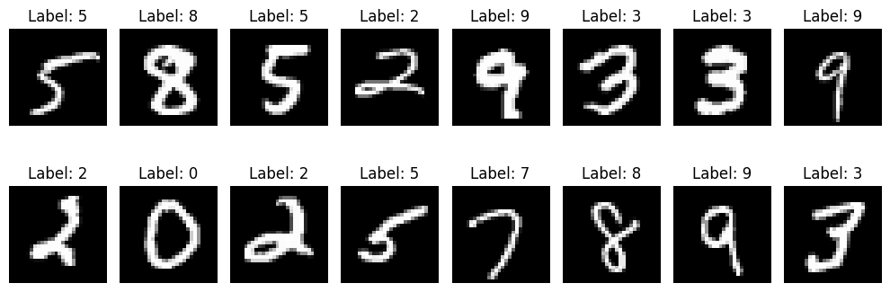
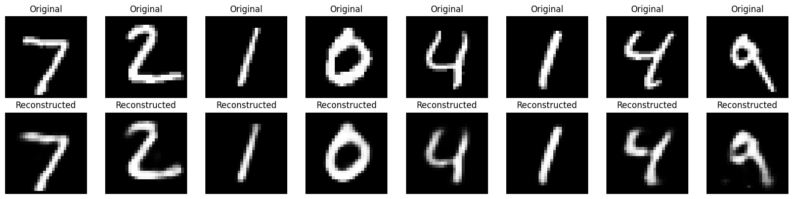
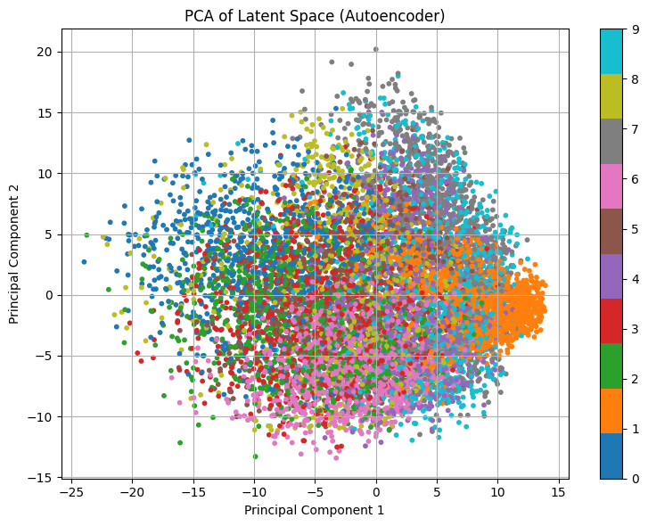

# AUTOENCODERS

An autoencoder is a type of neural network designed to learn efficient, compressed representations of input data **without supervision** (i.e., without label data).

It does this through a simple but powerful idea: **Try to reconstruct the input as accurately as possible, after passing it through a bottleneck**. 

This bottleneck forces the model to learn the most essential features of the data.

The network is composed of two main parts:

- **Encoder**: Compresses the input into a smaller latent vector (representation).
- **Decoder**: Reconstructs the input from the latent vector.

> **Note**: A *latent vector* is a cool name for the compressed or encoded data. It is a numerical representation of hidden or compressed information learned by a model.

Despite being trained in an unsupervised way (without labels), autoencoders can capture meaningful structure in data making them powerful for tasks like:

- Dimensionality reduction  
- Feature extraction  
- Denoising  
- Anomaly detection  
- Pretraining for downstream tasks  

---

## WHY DOES REPRESENTATION LEARNING MATTER?

In traditional machine learning, we often had to manually tell the computer what to look for in data.

For example, in image classification, you might manually extract:

- Edges  
- Color histograms  
- Texture patterns  

This works, but:

- It's time-consuming  
- It requires expert knowledge  
- It often doesn't generalize well to complex or messy real-world data (which is high-dimensional, noisy, and complex)

**Representation learning** is the process of *automatically discovering useful abstractions or encodings* of data.

**Autoencoders** are one of the most intuitive ways to approach this. They force the network to internalize structure in the data *without needing labels* and encode it into a compact **latent space**.

---

## ARCHITECTURE

At its core, an autoencoder is made up of two main components:

**Encoder → Latent Space → Decoder**

This pipeline takes an input, compresses it to a smaller hidden representation, and then reconstructs it back to its original form.


Let’s go right ahead and build an autoencoder, while I explain step-by-step.

---

## CODE AND EXPLANATION
You can find the code in this notebook:

👉 [View on GitHub](https://github.com/Tony-Ale/Notebooks/blob/main/Autoencoders.ipynb)

```python
# =======================
# Load the MNIST handwritten digit dataset and return DataLoaders for training and testing.
# Each image is converted to a PyTorch tensor and normalized to the [0, 1] range.
# DataLoaders enable efficient batching, shuffling, and iteration during training.
# =======================
from torchvision import datasets, transforms # Import MNIST dataset and image transforms
from torch.utils.data import DataLoader # For batching and loading the dataset

def get_mnist_loaders(batch_size=128):

  # Convert images to PyTorch tensors with values scaled to [0, 1]
  transform = transforms.ToTensor()

  # Download and load the training dataset
  train_dataset = datasets.MNIST(root='./data', train=True, download=True, transform=transform)

  # Download and load the test dataset
  test_dataset = datasets.MNIST(root='./data', train=False, download=True, transform=transform)

  # Wrap datasets in DataLoaders to enable batching and shuffling
  train_loader = DataLoader(train_dataset, batch_size=batch_size, shuffle=True)
  test_loader = DataLoader(test_dataset, batch_size=batch_size, shuffle=False)

  return train_loader, test_loader

```


```python
# =======================
# Visualize a batch of MNIST digit images from the training dataset.
# This function loads a mini-batch using get_mnist_loaders() and displays the digits with their labels.
# Useful for quickly inspecting the raw input data before training.
# =======================
import matplotlib.pyplot as plt # For plotting and displaying images
def visualize_batch(batch_size=16):
  # Load a mini-batch of training data
  train_loader, _ = get_mnist_loaders(batch_size)
  images, labels = next(iter(train_loader)) # Get the first batch

  # Create a horizontal grid of images
  plt.figure(figsize=(10, 4))
  for i in range(batch_size):
    plt.subplot(2, batch_size // 2, i + 1) # 2 rows, batch_size/2 columns
    plt.imshow(images[i][0], cmap='gray') # Show the image (channel 0 since MNIST is grayscale)
    plt.title(f"Label: {labels[i].item()}")
    plt.axis('off')
  plt.tight_layout()
  plt.show()
```


```python
visualize_batch()
```

    100%|██████████| 9.91M/9.91M [00:00<00:00, 17.5MB/s]
    100%|██████████| 28.9k/28.9k [00:00<00:00, 478kB/s]
    100%|██████████| 1.65M/1.65M [00:00<00:00, 4.44MB/s]
    100%|██████████| 4.54k/4.54k [00:00<00:00, 3.25MB/s]


    

    


```python
# =======================
# Define a fully-connected Autoencoder for compressing and reconstructing MNIST digit images.
# Architecture:
#   Encoder: 784 → 128 → 32
#   Decoder: 32 → 128 → 784
# The model learns to compress 28x28 images into a 32-dimensional latent space and reconstruct them.
# =======================
import torch
import torch.nn as nn

class Autoencoder(nn.Module):
    def __init__(self, input_dim=784, hidden_dim=128, latent_dim=32):
      super().__init__()

      # Encoder: compress input image to a 32-dimensional latent vector
      self.encoder = nn.Sequential(
          nn.Linear(input_dim, hidden_dim), # Flattened image → hidden layer
          nn.ReLU(),
          nn.Linear(hidden_dim, latent_dim), # Hidden → latent representation
      )

      # Decoder: reconstruct image from the latent vector
      self.decoder = nn.Sequential(
          nn.Linear(latent_dim, hidden_dim), # Latent → hidden layer
          nn.ReLU(),
          nn.Linear(hidden_dim, input_dim), # Hidden → reconstructed image
          nn.Sigmoid(),  # Match MNIST pixel range [0, 1]
      )

    def forward(self, x):
      x = x.view(x.size(0), -1) # Flatten image: [batch, 1, 28, 28] → [batch, 784]
      z = self.encoder(x) # Encode to latent vector
      out = self.decoder(z) # Decode back to reconstructed image
      return out
```


```python
# Load data
train_loader, test_loader = get_mnist_loaders()
```


```python
# Initialize model
device = torch.device('cuda' if torch.cuda.is_available() else 'cpu')
model = Autoencoder()
model.to(device)
```


    Autoencoder(
      (encoder): Sequential(
        (0): Linear(in_features=784, out_features=128, bias=True)
        (1): ReLU()
        (2): Linear(in_features=128, out_features=32, bias=True)
      )
      (decoder): Sequential(
        (0): Linear(in_features=32, out_features=128, bias=True)
        (1): ReLU()
        (2): Linear(in_features=128, out_features=784, bias=True)
        (3): Sigmoid()
      )
    )


```python
# =======================
# Set up the loss function and optimizer for training the autoencoder.
# We use Binary Cross Entropy (BCE) since the pixel values are in the [0, 1] range,
# and Adam optimizer for efficient gradient updates.
# =======================
criterion = nn.BCELoss() # Measures reconstruction loss between predicted and actual pixel values
optimizer = torch.optim.Adam(model.parameters(), lr=0.001)
```


```python
# =======================
# Train the autoencoder for a number of epochs using the training dataset.
# For each batch:
#   - Forward pass: input → encoded → decoded
#   - Compute reconstruction loss (BCE)
#   - Backpropagate and update model weights
# The average loss for each epoch is printed to monitor training progress.
# =======================
epochs = 10
for epoch in range(epochs):
  running_loss = 0.0
  for batch in train_loader:
    inputs, _ = batch # We ignore the labels; autoencoders are unsupervised
    inputs = inputs.to(device)
    optimizer.zero_grad()
    outputs = model(inputs)
    # Compute loss between reconstruction and original (flattened) input
    loss = criterion(outputs, inputs.view(inputs.size(0), -1))
    loss.backward()
    optimizer.step() # Update weights using gradients
    running_loss += loss.item()
  avg_loss = running_loss / len(train_loader)
  print(f"Epoch {epoch+1}/{epochs}, Loss: {avg_loss:.4f}")
```

    Epoch 1/10, Loss: 0.2028
    Epoch 2/10, Loss: 0.1228
    Epoch 3/10, Loss: 0.1065
    Epoch 4/10, Loss: 0.1000
    Epoch 5/10, Loss: 0.0961
    Epoch 6/10, Loss: 0.0932
    Epoch 7/10, Loss: 0.0910
    Epoch 8/10, Loss: 0.0893
    Epoch 9/10, Loss: 0.0879
    Epoch 10/10, Loss: 0.0868


```python
# Get a small batch
model.eval()
with torch.no_grad():
    sample_imgs, _ = next(iter(test_loader))
    sample_imgs = sample_imgs.to(device)
    reconstructed = model(sample_imgs)

# Plot original vs reconstructed
n = 8
plt.figure(figsize=(16, 4))
for i in range(n):
    # Original
    plt.subplot(2, n, i + 1)
    plt.imshow(sample_imgs[i][0].cpu(), cmap='gray')
    plt.title("Original")
    plt.axis('off')

    # Reconstructed
    plt.subplot(2, n, i + 1 + n)
    plt.imshow(reconstructed[i].view(28, 28).cpu(), cmap='gray')
    plt.title("Reconstructed")
    plt.axis('off')

plt.tight_layout()
plt.show()

```


    

    


```python
from sklearn.decomposition import PCA
# Collect latent vectors and labels
latents = []
labels = []

model.eval()
with torch.no_grad():
    for images, lbls in test_loader:
        images = images.to(device)
        z = model.encoder(images.view(images.size(0), -1))
        latents.append(z.cpu())
        labels.append(lbls)

latents = torch.cat(latents).numpy()   # e.g shape: [10000, 32]
labels = torch.cat(labels).numpy()     # e.g shape: [10000]

# Apply PCA
pca = PCA(n_components=2)
reduced = pca.fit_transform(latents)   # e.g shape: [10000, 2]

# Plot
plt.figure(figsize=(8, 6))
scatter = plt.scatter(reduced[:, 0], reduced[:, 1], c=labels, cmap='tab10', s=10)
plt.colorbar(scatter, ticks=range(10))
plt.title("PCA of Latent Space (Autoencoder)")
plt.xlabel("Principal Component 1")
plt.ylabel("Principal Component 2")
plt.grid(True)
plt.tight_layout()
plt.show()
```


    

    


```python

```


---

## LATENT SPACE VISUALIZATION

In an autoencoder, the **latent space** is the compressed internal representation of the input data. 

It’s the output of the encoder; a lower-dimensional vector that tries to capture the most important features of the input.

For our model, we reduce each **784-dimensional MNIST digit image** down to a **32-dimensional latent vector**. These vectors should contain enough information for the decoder to reconstruct the original digit.

But since 32 dimensions are too many to visualize directly, we reduce them to **2D** using **PCA**.

### Principal Component Analysis (PCA)

PCA is a classic linear dimensionality reduction technique. It works by:

1. Identifying the directions (called *principal components*) along which the data varies the most.  
2. Projecting the data onto the top few components, preserving the largest variance.

For visualization:

- We reduce our 32D latent vectors to just 2D.
- Plot them and color each point by its corresponding digit label (0–9).

After training the autoencoder:

1. We pass the test set through the encoder to extract latent vectors.  
2. Apply PCA to reduce the 32D vectors to 2D.  
3. Plot the 2D vectors, coloring each point by digit class.

As seen in the plot, the latent space contains **overlapping regions** for different digits. This is expected because:

- The model was **not trained with label information**.  
- It was only optimizing for **reconstruction accuracy**, not class separation.

This motivates **more advanced autoencoder variants**, such as:

- Variational Autoencoders (VAEs)  
- Supervised Autoencoders  

---

## MOTIVATION FOR AUTOENCODER VARIANTS

While basic autoencoders are powerful tools for unsupervised learning, they come with limitations that motivate more advanced variants.

A standard autoencoder might:

- Overfit to training data  
- Memorize fine details without learning meaningful structure  
- Produce latent representations that are not robust to noise or variation  

This lack of generalization can make the model brittle and limit its usefulness for real-world applications.

| Variant                           | What It Adds                                            | Why It Matters                                        |
| --------------------------------- | ------------------------------------------------------- | ----------------------------------------------------- |
| **Denoising Autoencoder**         | Adds noise to input and trains to recover clean output  | Improves robustness to noisy or incomplete data       |
| **Sparse Autoencoder**            | Applies L1 penalty to activations                       | Forces model to learn compact, efficient features     |
| **k-Sparse Autoencoder**          | Keeps only top-k activations per layer                  | Encourages sparsity with hard constraints             |
| **Contractive Autoencoder**       | Penalizes sensitivity to small input changes            | Makes model more stable and less sensitive            |
| **Variational Autoencoder (VAE)** | Adds probabilistic structure (Gaussian prior + KL loss) | Learns smooth, continuous, interpretable latent space |

---
