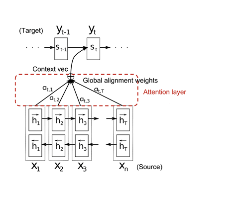

# Bahdanau Attention Explained: Teaching Machines to Focus Like Humans

Imagine you’re translating an English book into French. You come across this long sentence:

*“Michael traveled to Japan in April, explored the temples, tasted new foods, made many friends, and keeps telling stories that make me want to visit as well.”*

Would you read the whole English sentence in one go, memorize it perfectly, and then spit out the entire French translation?
Of course not.

As humans, we translate step by step. We look at a small piece of the sentence, translate it, then move our focus forward. This way, we don’t have to memorize everything at once; we just pay attention to the right parts when needed.

This is exactly the idea behind Bahdanau Attention (sometimes called Additive Attention).

---

## The Problem: RNNs Forget Long Sentences

Before attention, machine translation used a simple encoder-decoder architecture:

* The encoder (usually an RNN, GRU, or LSTM) reads the English sentence and squashes all its meaning into a single vector.
* The decoder takes that vector and generates the French translation.

This worked for short sentences, but as sentences got longer (30+ words), performance dropped dramatically. Why?

Because cramming an entire paragraph into a single vector is like trying to stuff a whole library into a backpack; Something important always gets left behind.

---

## The Insight: Focus on What Matters

Bahdanau, Cho, and Bengio (2014) proposed a brilliant solution:
Instead of forcing the decoder to memorize the entire sentence, let it look back at the encoder whenever it needs help.

At each step of translation, the decoder doesn’t rely on just one compressed vector, it asks:

* *“Which part of the English sentence should I pay attention to while generating this French word?”*

This dynamic looking-back is what we call attention.

---

## How Attention Works (Step by Step)

Let’s use a simple French to English example:

French Input: *“Jane visite l’Afrique en Septembre.”*
English Output: *“Jane visits Africa in September.”*



### Step 1: Encoding the Input

We will create an embedding vector for each word in our vocabulary. For example, words like *Jane*, *visite*, and *l’Afrique* will each have their own embedding vector. These embeddings are then passed to the encoder at the appropriate time step.

The encoder is typically a bidirectional RNN, often an LSTM, though a GRU can also be used. The reason we choose a bidirectional encoder is that; when reading some sentences, you can only fully understand their meaning once you also look ahead. Similarly, for our RNN to capture the meaning and context of words, it must process the sentence not only from left to right but also from right to left. This allows it to fully grasp the sentence.

Since the encoder is bidirectional, each time step (that is, each word) produces two hidden states, which are concatenated into one feature vector:

<div>
$$
h_{j} = \big[ \overrightarrow{h}_{j}, \ \overleftarrow{h}_{j} \big]
$$
</div>

Here, $h_{j}$ is known as the **annotation** of the word $x_{j}$ at time step $j$. This annotation contains summaries of both the preceding and following words. These annotations will later be used by the decoder, together with an **alignment model**, to compute a **context vector**.

Don’t worry about the new terms *alignment model* and *context vector*; I’ll explain them as we go further.

---

### Step 2: The Alignment Model, Context Vector, and Decoder

After a sentence has been encoded, the next step is to decode or translate it. The decoder, like the encoder, is an RNN, but this time it is uni-directional, it generates one output at a time, step by step.

At each time step, the decoder requires three inputs:

1. The previously generated output (translation from the last step).
2. The hidden state at the current time step.
3. The context vector (which carries information from the encoder).

A natural question arises: *What do we feed as the “previous translation” when the decoding process is just starting?*
During training, we use **special tokens**:

* `<SOS>` (Start of Sequence) → indicates the beginning of a sentence.
* `<EOS>` (End of Sequence) → indicates the end of a sentence.

Thus, the first input to the decoder at the very start is `<SOS>`.

The hidden state at each time step is automatically handled by deep learning frameworks like PyTorch when using RNNs, LSTMs, or GRUs. (If you want to see the math behind how hidden states are computed, check out my earlier posts on RNNs, LSTMs, or GRUs.)

Now, the interesting part is the context vector.
When the decoder is about to generate a word, it doesn’t just look at the last encoder hidden state. Instead, it looks at all encoder hidden states and determines which parts of the input sentence are most relevant.

This is achieved using the attention parameter $\alpha$ (alpha).

* For each decoding step $i$, a set of attention weights $\alpha_{ij}$ is computed—one for each encoder hidden state $h_j$.
* These weights act like importance scores: a higher $\alpha_{ij}$ means the decoder should “pay more attention” to that part of the input sentence.

The context vector $c_i$ is then a weighted sum of all encoder hidden states:

$$
c_i = \sum_{j=1}^{T_x} \alpha_{ij} h_j
$$

where:

* $T_x$ = length of the input sentence,
* $h_j$ = encoder hidden state at position $j$,
* $\alpha_{ij}$ = attention weight assigned to $h_j$ when producing output $y_i$.

The attention weights are computed using a softmax over a scoring function:

$$
\alpha_{ij} = \frac{\exp(e_{ij})}{\sum_{k=1}^{T_x} \exp(e_{ik})}
$$

Here,

$$
e_{ij} = a(s_{i-1}, h_j)
$$

is the alignment score, which measures how well the input around position $j$ (encoder state $h_j$) matches the output at position $i$ (decoder state $s_{i-1}$).

The alignment model $a(\cdot)$ is typically a feed-forward neural network, and it is trained jointly with the rest of the seq2seq model.

Finally, the output of the decoder at each time step is passed through another feed-forward neural network (often just a linear layer), which projects the decoder’s hidden state into a vector of size equal to the vocabulary. This gives us a probability distribution over all possible next words in the target language.

---

### Step 3: Training, Inference, and Teacher Forcing

Machine translation is formulated as a supervised learning problem: we have an input sequence (source sentence) and a target sequence (translated sentence). The goal is to minimize an objective function, typically the cross-entropy loss, which measures the difference between the predicted distribution and the ground-truth distribution at each decoding step.

During training:

1. The model generates predictions.
2. These predictions are compared with the ground truth target sequence.
3. The cross-entropy loss is computed:
4. Gradients of this loss are backpropagated, and an optimizer (e.g., Adam) updates the model parameters.


#### Teacher Forcing

Recall that at each decoding step, the decoder expects the token from the previous step as one of its input. This creates a choice:

* Should we feed the decoder its own prediction from the previous step?
* Or should we instead feed it the ground truth token from the training data?

The strategy of occasionally using the ground truth is called teacher forcing.

Formally, a teacher forcing ratio $r \in [0,1]$ is defined:

* With probability $r$, the decoder receives the ground truth token.
* With probability $1-r$, the decoder receives its own prediction from the previous step.

This can be summarized as:

<div>
$$
\text{Input to decoder at step } t = 
\begin{cases} 
y_{t-1}, & \text{with probability } r \\
\hat{y}_{t-1}, & \text{with probability } 1-r
\end{cases}
$$
</div>

where $y_{t-1}$ is the ground truth and $\hat{y}_{t-1}$ is the predicted token.

Teacher forcing helps the model converge faster during training, but relying too heavily on it can cause the model to struggle during inference (since ground truth tokens are no longer available).


#### Inference

At inference time, the teacher forcing ratio is set to 0.
This means the decoder must always use its own predictions as input for the next step. This setup reflects the real-world translation scenario and allows us to evaluate how well the model generalizes without access to the ground truth.

---

## Masking

When working with sequence data, one common challenge is that sequences often have different lengths. However, for efficient training, we rely on matrix multiplication, which requires tensors to have consistent dimensions. If we try to batch together sequences of varying lengths, we’ll run into dimension mismatches that break matrix operations.

To solve this, we ensure that all sequences in a batch have the same length. The standard approach is to find the maximum sequence length in the dataset, and then pad all shorter sequences with a special padding token. In my implementation, I used `0` as the padding token. This allows us to batch sequences together and leverage the speed of parallelized matrix multiplication, making training much faster.

In the PyTorch ecosystem, many classes and functions (such as `nn.Embedding` and `nn.CrossEntropyLoss`) provide parameters to specify the padding index. This ensures that padded positions (e.g., tokens with index `0` in my case) are ignored during training and do not affect the model’s learning.

Finally, padding alone isn’t enough, we also need a mask to distinguish between real tokens and padded tokens. The mask is simply a binary matrix where each row corresponds to a sequence:

* `1` indicates a valid token.
* `0` indicates a padded token.

This mask helps the model focus only on meaningful parts of the sequence while ignoring the padding.

---

## CODE AND EXPLANATION

We will implement Bahdanau et al.’s attention mechanism from scratch, and then train a model to reverse a sequence of numbers. For example, if the input to the model is [3, 5, 7, 8], the output will be [8, 7, 5, 3].

You can explore the notebook here:

- 📘 <a href="https://github.com/Tony-Ale/Notebooks/blob/main/Bahdanau_Attention.ipynb" target="_blank">View on GitHub</a>  
- 🚀 <a href="https://colab.research.google.com/github/Tony-Ale/Notebooks/blob/main/Bahdanau_Attention.ipynb" target="_blank">Open in Colab</a>

---

### Setting up the encoder


```python
import torch
import torch.nn as nn
from torch import Tensor
from typing import Tuple
import random

class Encoder(nn.Module):
  def __init__(self, embedding_dim, enc_hidden_dim, vocab_size):
    super().__init__()

    self.encoder = nn.LSTM(embedding_dim, enc_hidden_dim, batch_first=True, bidirectional=True)
    self.embedding = nn.Embedding(vocab_size, embedding_dim, padding_idx=0)
    self.enc_hidden_dim = enc_hidden_dim

  def forward(self, x:Tensor, lengths:Tensor):
    # x ->  (B, L) indices of words in sentences.
    # B-> Batch size
    # L-> Sequence Length
    # H-> Input size/embedding dimension
    # Hout-> encoder hidden dim
    # for example if there are 3 sentences each having 10 words, B=3, L=10, H=embedding dim
    emb = self.embedding(x) # (B, L, H)
    packed = nn.utils.rnn.pack_padded_sequence(emb, lengths, batch_first=True, enforce_sorted=False)
    packed_out, hidden_n = self.encoder(packed)

    # unpack back to (B, L, 2*Hout), with true lengths
    h, _ = nn.utils.rnn.pad_packed_sequence(packed_out, batch_first=True)
    return h, hidden_n # h -> (B, L, D*Hout) where D=2 because it is bi-directional


```

#### Why nn.utils.rnn.pack_padded_sequence and nn.utils.rnn.pad_packed_sequence

We use `nn.utils.rnn.pack_padded_sequence` to efficiently handle batches that contain sequences of different lengths. Without packing, the LSTM would waste computation on the padded tokens, which carry no useful information.

By packing:

* The LSTM only processes the valid (non-padded) tokens in each sequence.
* Training becomes faster and more memory-efficient.
* The model’s hidden states are not influenced by meaningless padding.

**Without packing**

If you have 3 sequences padded to the same length:

```
Seq1: [3, 5, 7, 0, 0]   (length 3)  
Seq2: [2, 4, 0, 0, 0]   (length 2)  
Seq3: [9, 8, 6, 5, 1]   (length 5)  
```

Shape = `(batch=3, length=5, embedding_dim=H)`

The LSTM will process all 5 steps for all 3 sequences, even though most tokens are padding. That wastes compute and can confuse the model if we don’t mask them out.


**With pack_padded_sequence**

`pack_padded_sequence` takes the embeddings + the true lengths and converts them into a PackedSequence object, which internally stores only the valid tokens (ignoring the padding).

So in the above example, the packed data looks more like this (conceptually):

```
Time step 1: [3, 2, 9]  
Time step 2: [5, 4, 8]  
Time step 3: [7,    6]  
Time step 4: [     5]  
Time step 5: [     1]  
```

(the blanks represent padded positions that were removed).

Now the LSTM only iterates over the real tokens, making training faster and cleaner.

**After the LSTM**

Since many downstream layers (like attention) expect a padded tensor again, we use `pad_packed_sequence` to convert the output back to `(batch, seq_len, hidden_dim)` shape; but now with correct zero-padding.

**What happens if you don't use nn.utils.rnn.pack_padded_sequence and nn.utils.rnn.pad_packed_sequence?**

Your model can still learn to perform the task (for example, reversing a sequence), but it will only work reliably when the input has the same length as the maximum length used during training.

Why? Because without packing, the model processes the padded positions as if they were real tokens. It never truly learns that sequences can end earlier than the maximum length. Instead, it assumes that every sequence always stretches to that fixed size. As a result, the model becomes biased toward handling only “full-length” inputs, and its performance on shorter or variable-length sequences will be poor.

---
### Setting up the Attention class

```python
class Attention(nn.Module):
  def __init__(self, enc_hidden_dim, dec_hidden_dim, attn_dim):
    super().__init__()

    self.W_h = nn.Linear(enc_hidden_dim, attn_dim)
    self.W_s = nn.Linear(dec_hidden_dim, attn_dim)
    self.am = nn.Linear(attn_dim, 1) # alignment model
  def forward(self, h:Tensor, s:Tensor, mask:Tensor=None):
    # h-> (B, L, 2*enc_hidden_dim) encoder output

    # s-> (B, dec_hidden_dim) the decoder hidden state

    # project encoder output
    proj_enc = self.W_h(h) # (B, L, attn_dim)
    # project decoder hidden
    proj_dec = self.W_s(s).unsqueeze(1) # (B, 1, attn_dim)

    e = self.am(torch.tanh(proj_enc + proj_dec)).squeeze(-1) # (B, L)

    if mask is not None:
      # to ensure that padded positions after softmax have their weights to be zero
      # which means; do not pay attention here.
      e = e.masked_fill(mask==0, value=float("-inf"))

    attn_weights = torch.softmax(e, dim=-1) # (B, L)

    context = torch.bmm(attn_weights.unsqueeze(1), h).squeeze(1) # (B, 2*enc_hidden_dim)

    return context, attn_weights

```

---

### Setting up the feed forward model to output probabilities

```python
class GenerateWordProb(nn.Module):
  def __init__(self, dec_hidden_dim, enc_hidden_dim, vocab_size):
    super().__init__()

    self.fc1 = nn.Linear(dec_hidden_dim + enc_hidden_dim, vocab_size)
    self.dropout = nn.Dropout(0.4)
  def forward(self, context, decoder_output):
    enc_dec_output = torch.cat([context, decoder_output], dim=-1) # (B, dec_hidden_dim + enc_hidden_dim)
    enc_dec_output = self.dropout(enc_dec_output)
    logits = self.fc1(enc_dec_output) # (B, vocab_size)
    return logits
```

---

### Setting up the decoder

```python
class Decoder(nn.Module):
  def __init__(self, dec_hidden_dim, vocab_size, embedding_dim, enc_hidden_dim, attn_dim):
    super().__init__()

    enc_hidden_dim = 2*enc_hidden_dim # because of bidirectional encoder
    self.embedding = nn.Embedding(vocab_size, embedding_dim, padding_idx=0)

    # input to decoder is the is the previous generated token, the context vector and the hidden state.
    # 2*enc_hidden_dim:  is because the context is coming from a bidirectional encoder
    self.decoder = nn.LSTM(embedding_dim + enc_hidden_dim, dec_hidden_dim, batch_first=True)
    self.attn = Attention(enc_hidden_dim, dec_hidden_dim, attn_dim)

    self.out = GenerateWordProb(dec_hidden_dim, enc_hidden_dim, vocab_size)

    self.dec_hidden_dim = dec_hidden_dim
    # projection layers for h and c
    self.h_proj = nn.Linear(enc_hidden_dim, dec_hidden_dim)
    self.c_proj = nn.Linear(enc_hidden_dim, dec_hidden_dim)

  def init_hidden(self, hidden_n):
    # initialize hidden state

    h, c = hidden_n  # (num_layers*2, B, Hout)
    # concat forward/backward hidden states from last layer
    h_cat = torch.cat((h[-2], h[-1]), dim=-1)  # (B, 2*Hout)
    c_cat = torch.cat((c[-2], c[-1]), dim=-1)  # (B, 2*Hout)

    # project to decoder hidden size
    h0 = torch.tanh(self.h_proj(h_cat)).unsqueeze(0)  # (1, B, dec_hidden_dim)
    c0 = torch.tanh(self.c_proj(c_cat)).unsqueeze(0)  # (1, B, dec_hidden_dim)

    # init hidden state for decoder
    hidden = (h0, c0)
    return hidden

  def forward_step(self, x:Tensor, encoder_output:Tensor, last_hidden:Tuple[Tensor, Tensor], mask=None):
    """Because the decoder depends on the previously generated token as an input
      The attention context is recomputed at every step based on the current decoder hidden state.
      The hidden state evolves step-by-step, so you can't precompute all decoder states in parallel.
      Therefore we will use a for loop to iterate over each step.
    """
    # x -> (B,) indices of words
    # encoder_output (h) -> (B, L, 2*enc_hidden_dim)

    emb = self.embedding(x) # (B, embedding_dim)

    s_n = last_hidden[0].squeeze(0) # (1, B, dec_hidden_dim) the decoder hidden state

    contexts, attn_weights = self.attn(encoder_output, s_n, mask)
    # contexts -> (B, 2*enc_hidden_dim)

    decoder_in = torch.cat([emb.unsqueeze(1), contexts.unsqueeze(1)], dim=-1) # (B, 1, embedding_dim + 2*enc_hidden_dim)

    output, new_hidden = self.decoder(decoder_in, last_hidden) # output -> (B, 1, dec_hidden_dim)

    logits = self.out(contexts, output.squeeze(1)) # (B, vocab_size)

    return logits, new_hidden, attn_weights

  def forward(self, target_seq:Tensor, encoder_output:Tensor, hidden_n:Tuple[Tensor, Tensor], mask=None, teacher_forcing_ratio=0.5, use_enc_hidden=False):
    """
    target_seq (B, target_seq_len) indices of target words

    In sequence-to-sequence models (like RNNs with attention), teacher forcing is a training strategy where the
    model is fed the ground truth token from the previous time step instead of its own prediction.
    The teacher forcing ratio is a probability (between 0 and 1) that determines how often this happens.
    If a random number < teacher_forcing_ratio, then ground truth token is used as input for the next step.
    Otherwise, the model uses its own predicted token from the previous step.

    hidden_n; the encoder last hidden and cell state
    """
    B, seq_len = target_seq.size()

    logits_seq = []
    attn_seq = []
    x = target_seq[:, 0] # (B,) the first token is <sos>

    if use_enc_hidden:
      hidden = self.init_hidden(hidden_n)
    else:
      s_n_init = torch.zeros(1, B, self.dec_hidden_dim).to(target_seq.device)
      c_n_init = torch.zeros(1, B, self.dec_hidden_dim).to(target_seq.device)

      init_hidden = (s_n_init, c_n_init)
      hidden = init_hidden

    for t in range(1, seq_len): # starting from one because we want to skip the <sos> token
      logits, hidden, attn_weights = self.forward_step(x, encoder_output, hidden, mask)
      logits_seq.append(logits.unsqueeze(1))
      attn_seq.append(attn_weights.unsqueeze(1))
      teacher_force = random.random() < teacher_forcing_ratio
      if teacher_force:
        # Ground truth
        x = target_seq[:, t]
      else:
        x = logits.argmax(dim=-1)
    logits_seq = torch.cat(logits_seq, dim=1) # (B, target_seq_len-1, vocab)
    attn_seq = torch.cat(attn_seq, dim=1) #  (B, target_seq_len-1, L)
    return logits_seq, attn_seq


```

---

### Setting up the mask

```python
def make_mask(data:Tensor, pad_idx=0):
  # data -> (B, seq_len)
  return (data != pad_idx).to(data.device)
```

---

### class to generate synthetic data


```python
# Creating a synthetic dataset to test my implementation of attention
from torch.utils.data import Dataset, DataLoader
import random
class SyntheticDataset(Dataset):
  def __init__(self, n_samples=10000, seq_len=10, vocab_size=50, task="copy"):
    super().__init__()
    self.samples = []
    for _ in range(n_samples):
      length = random.randint(3, seq_len)
      seq = [random.randint(3, vocab_size-1) for _ in range(length)]

      if task == 'copy':
        target = seq[:]
      elif task == 'reverse':
        target = seq[::-1]

      # add <sos>=1 and <eos>=2 for target
      self.samples.append((seq, [1]+target+[2]))

    self.vocab_size = vocab_size
  def __len__(self):
    return len(self.samples)
  def __getitem__(self, idx):
    return self.samples[idx]


```


---

### setting up the collate function for the dataloader

```python
# set up collate function for dataloader
def collate_fn(batch, pad_idx=0):
  data, target = zip(*batch)
  data_lengths = [len(seq) for seq in data]
  max_data_len = max(data_lengths)
  max_tgt_len = max([len(tgt) for tgt in target])
  padded_data = [seq + [pad_idx]*(max_data_len-len(seq)) for seq in data]
  padded_target = [seq + [pad_idx]*(max_tgt_len-len(seq)) for seq in target]
  return torch.tensor(padded_data), torch.tensor(padded_target), torch.tensor(data_lengths)
```

---
### Setting up the dataloader

```python
dataset = SyntheticDataset(n_samples=10000, seq_len=12, vocab_size=50, task='reverse')
train_loader = DataLoader(dataset, batch_size=64, shuffle=True, collate_fn=collate_fn)
```

---

### Initialise the models

```python
# Initialise model
encoder = Encoder(embedding_dim=64, enc_hidden_dim=128, vocab_size=dataset.vocab_size)
decoder = Decoder(dec_hidden_dim=128, vocab_size=dataset.vocab_size, embedding_dim=64, enc_hidden_dim=128, attn_dim=64)
device = torch.device("cuda" if torch.cuda.is_available() else "cpu")
encoder.to(device)
decoder.to(device)
```


    Decoder(
      (embedding): Embedding(50, 64, padding_idx=0)
      (decoder): LSTM(320, 128, batch_first=True)
      (attn): Attention(
        (W_h): Linear(in_features=256, out_features=64, bias=True)
        (W_s): Linear(in_features=128, out_features=64, bias=True)
        (am): Linear(in_features=64, out_features=1, bias=True)
      )
      (out): GenerateWordProb(
        (fc1): Linear(in_features=384, out_features=50, bias=True)
        (dropout): Dropout(p=0.4, inplace=False)
      )
      (h_proj): Linear(in_features=256, out_features=128, bias=True)
      (c_proj): Linear(in_features=256, out_features=128, bias=True)
    )


---

### set up the loss function and optimizer

```python
criterion = nn.CrossEntropyLoss(ignore_index=0)
params = list(encoder.parameters())+list(decoder.parameters())
optimizer = torch.optim.Adam(params, lr=0.001)
```

---

### Train the model

```python
epochs =  10
encoder.train()
decoder.train()
for epoch in range(epochs):
  running_loss = 0.0
  for data, target, lengths in train_loader:
    data = data.to(device)
    target = target.to(device)
    lengths = lengths.to(device)

    optimizer.zero_grad()
    encoder_output, hidden_n = encoder(data, lengths)
    mask = make_mask(data)
    logits_seq, attn_seq = decoder(target, encoder_output, hidden_n, mask=mask, teacher_forcing_ratio=0.5)
    # logits seq is (B, target_seq_len-1, vocab)
    tgts = target[:, 1:logits_seq.size(1)+1]
    loss = criterion(logits_seq.view(-1, logits_seq.size(-1)), tgts.reshape(-1))
    loss.backward()
    torch.nn.utils.clip_grad_norm_(params, 1.0)
    optimizer.step()
    running_loss += loss.item()
  print(f"Epoch {epoch+1}, Loss: {running_loss/len(train_loader)}")

```

    Epoch 1, Loss: 2.3242060840129852
    Epoch 2, Loss: 0.4465853155228742
    Epoch 3, Loss: 0.26459415764755506
    Epoch 4, Loss: 0.14399968214617792
    Epoch 5, Loss: 0.08282175400905359
    Epoch 6, Loss: 0.07343465957351646
    Epoch 7, Loss: 0.08730173831105612
    Epoch 8, Loss: 0.04399116863170342
    Epoch 9, Loss: 0.06232075718569623
    Epoch 10, Loss: 0.05614654439098089


---

### A function to test the model


```python
def test_model(seq, max_len=20):
  encoder.eval(); decoder.eval()
  src = torch.tensor([seq], device=device)
  length = torch.tensor([len(seq)], device=device)
  with torch.no_grad():
      enc_out, hidden_n = encoder(src, length)
      mask = make_mask(src)

      # initialize hidden state
      #hidden = decoder.init_hidden(hidden_n)
      B = src.size(0)
      s_n_init = torch.zeros(1, B, decoder.dec_hidden_dim).to(device)
      c_n_init = torch.zeros(1, B, decoder.dec_hidden_dim).to(device)

      init_hidden = (s_n_init, c_n_init)
      hidden = init_hidden

      # start with <sos>
      x = torch.tensor([1], device=device)  # (B,)
      preds, attns = [], []

      for _ in range(max_len):
        logits, hidden, attn_weights = decoder.forward_step(x, enc_out, hidden, mask)
        next_token = logits.argmax(-1)  # greedy
        preds.append(next_token.item())
        attns.append(attn_weights.unsqueeze(1))

        if next_token.item() == 2:  # <eos>
          break
        x = next_token  # feed back prediction

  attns = torch.cat(attns, dim=1)
  return preds, attns

```

---

### A function to visualize attention


```python
import matplotlib.pyplot as plt
import seaborn as sns
import torch

def plot_attention(attention_weights, src_seq, tgt_seq, idx2token=None, title="Attention Heatmap"):
    """
    Plots a heatmap of attention weights between source and target sequences.

    Args:
        attention_weights (torch.Tensor): [tgt_len, src_len] tensor (after softmax).
        src_seq (list[int]): Source token IDs (e.g. input sequence).
        tgt_seq (list[int]): Target token IDs (e.g. predicted output sequence).
        idx2token (dict[int,str], optional): Mapping from token ID to string for readability.
        title (str): Title of the plot.
    """

    # Convert token IDs to strings if mapping provided
    if idx2token is not None:
        src_labels = [idx2token[idx] for idx in src_seq]
        tgt_labels = [idx2token[idx] for idx in tgt_seq]
    else:
        src_labels = [str(idx) for idx in src_seq]
        tgt_labels = [str(idx) for idx in tgt_seq]

    # Prepare attention matrix
    attn = attention_weights.detach().cpu().numpy()

    plt.figure(figsize=(10, 8))
    ax = sns.heatmap(attn,
                     xticklabels=src_labels,
                     yticklabels=tgt_labels,
                     cmap="viridis",
                     cbar=True,
                     linewidths=0.5,
                     linecolor="gray",
                     annot=True,  # write values in cells
                     fmt=".2f")

    plt.xlabel("Source Sequence (Input)")
    plt.ylabel("Target Sequence (Output)")
    plt.title(title, fontsize=14, pad=20)
    plt.xticks(rotation=45, ha="right")
    plt.yticks(rotation=0)

    plt.tight_layout()
    plt.show()

```

---

### Test the model by reversing a sequence

```python
# Try with a random input
test_seq = [7, 9, 25, 26, 23, 23]
print("Input:", test_seq)
pred, attn_weights = test_model(test_seq)
print("Predicted Output:", pred)
print("Expected Output:", test_seq[::-1] + [2])  # reversed + <eos>
```

    Input: [7, 9, 25, 26, 23, 23]
    Predicted Output: [23, 23, 26, 25, 9, 7, 2]
    Expected Output: [23, 23, 26, 25, 9, 7, 2]


---

### Visualize attention


```python
plot_attention(attn_weights[0], test_seq, pred)
```


    
