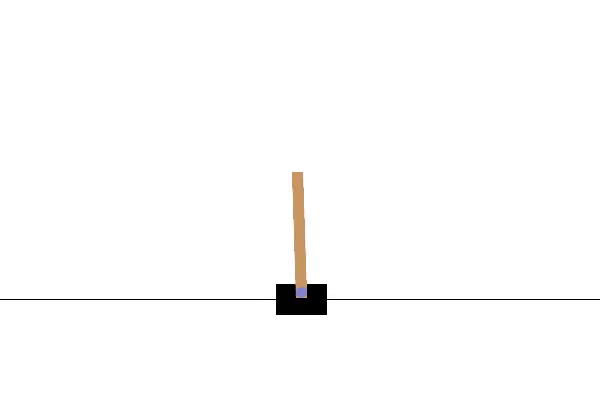
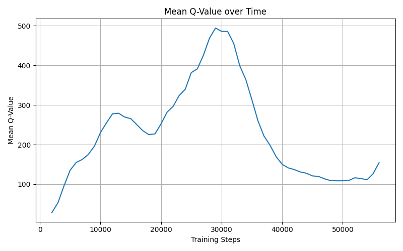
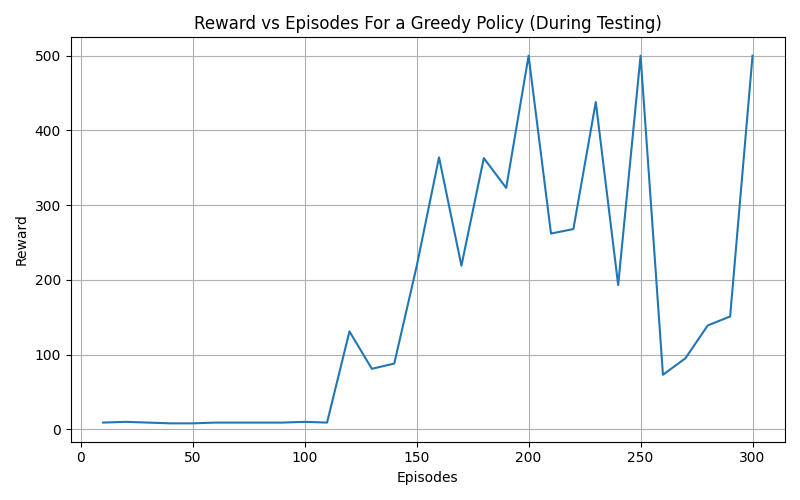
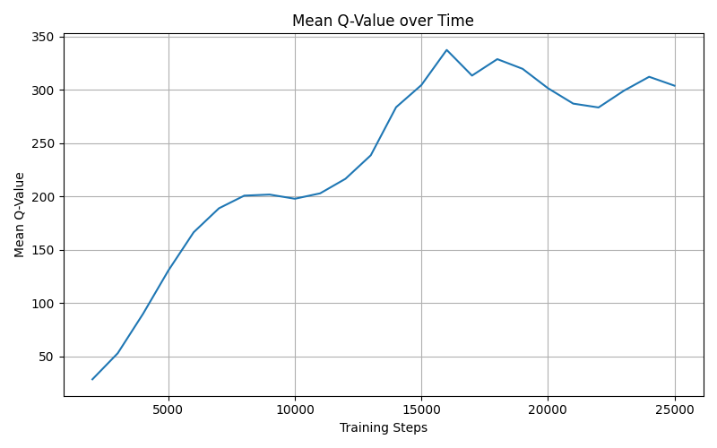
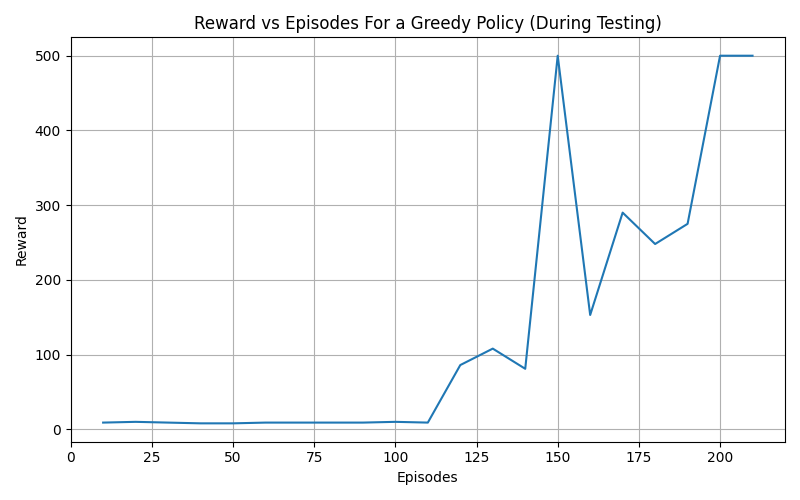
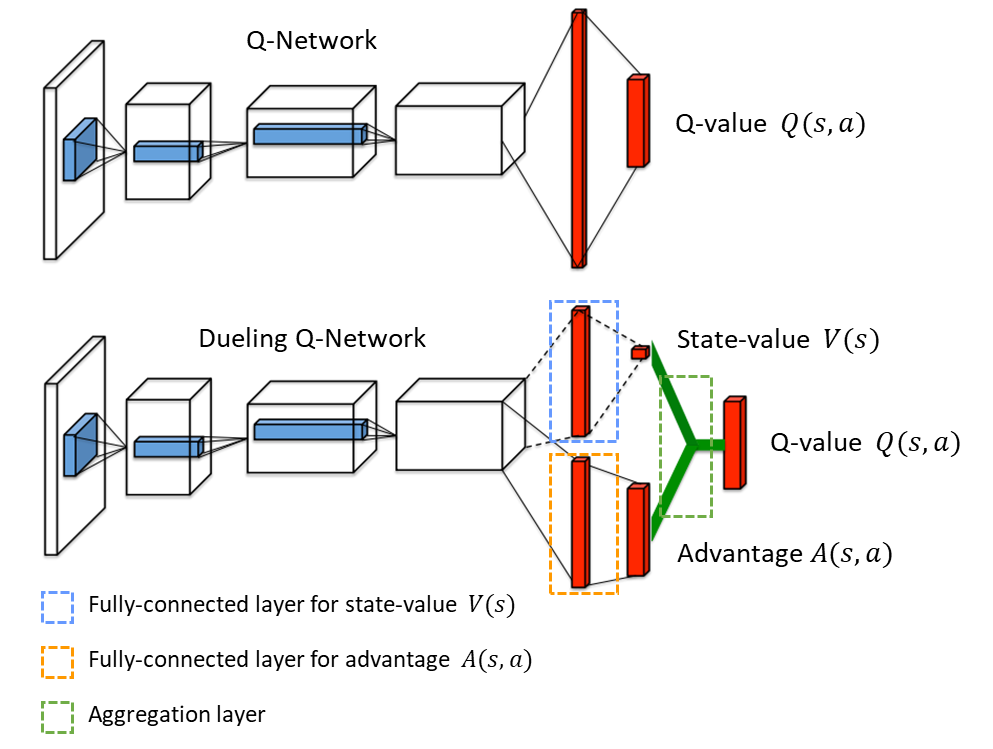
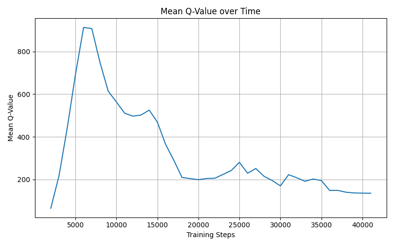
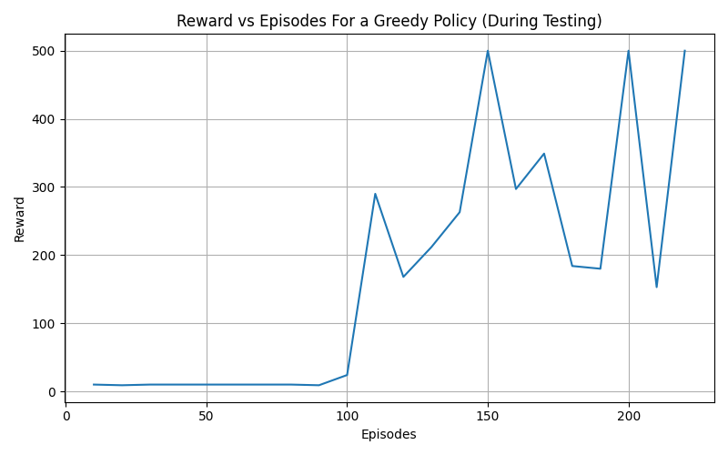

# DQN AND ITS VARIANTS

## Temporal Difference Learning

Unlike Monte Carlo methods, which wait until the end of an episode before updating the value function, Temporal Difference (TD) learning updates the value estimate at every time step.

The TD update rule for the state-value function is:

$$
V(S_t) \leftarrow V(S_t) + \alpha \big[ R_{t+1} + \gamma V(S_{t+1}) - V(S_t) \big]
$$

This equation updates the current estimate $ V(S_t) $ using the temporal difference error, which measures the discrepancy between the current estimate and a one-step lookahead estimate.

The temporal difference error is:

$$
\delta_t = R_{t+1} + \gamma V(S_{t+1}) - V(S_t)
$$

Intuitively, temporal difference methods learn a good guess from a guess, which may seem rather odd, because we are learning from a guess without knowing the actual outcome. Nevertheless, it is guaranteed that it will converge to the correct answer. A major advantage of temporal difference methods over other methods is that you don’t have to wait until the end of an episode before learning occurs, and this is particularly useful in cases where the episodes are too long or the problem is a continuing task and has no episodes at all.

---

## Q-Learning

One of the major breakthroughs in reinforcement learning was the development of Q-learning, an off-policy TD control algorithm.

In Q-learning, the action-value function $ Q(s, a) $ directly approximates the optimal action-value function $ q^*(s, a) $, regardless of the policy being followed.

The Q-learning update rule is:

$$
Q(S_t, A_t) \leftarrow Q(S_t, A_t) + \alpha \big[ R_{t+1} + \gamma \max_a Q(S_{t+1}, a) - Q(S_t, A_t) \big]
$$

### Q-Learning Algorithm

**Algorithm parameters:**

* Step size $ \alpha \in (0, 1] $
* Small $ \epsilon > 0 $ for exploration

**Initialize:**

* $ Q(s, a) $ arbitrarily for all states $ s \in S $ and actions $ a \in A(s) $
* Set $ Q(\text{terminal}, \cdot) = 0 $

**For each episode:**

1. Initialize state $ S $
2. For each step of the episode:

   * Choose action $ A $ from $ S $ using a policy derived from $ Q $ (e.g., $ \epsilon $ -greedy)
   * Take action $ A $, observe reward $ R $ and next state $ S' $
   * Update:
     $$
     Q(S, A) \leftarrow Q(S, A) + \alpha \big[ R + \gamma \max_a Q(S', a) - Q(S, A) \big]
     $$
   * Set $ S \leftarrow S' $
3. Repeat until $ S $ is terminal

### Maximization Bias in Q-Learning

From the Q-learning formula above, it is seen that the target policy is a greedy policy. For some control algorithms, the target policies are constructed in a greedy manner, which leads to a bias called maximization bias. Why are we considering this bias since our results always converge? Consider a single state $ s $
where there are many actions $ a $ whose true action-values are all zero, but their estimated values are uncertain and thus distributed, with some above and some below zero. The maximum of the true values is zero, but the maximum of the estimates is positive; a positive bias. This means algorithms affected by this bias will overestimate the true value of a state, which can slow down learning and degrade performance

To curb this problem in Q-learning, the idea of double learning is introduced. The idea is that instead of using just a single target Q function to determine both the greedy action and its value, we use two Q functions to learn two independent estimates. One function is used to determine the maximizing action, while the other function is used to estimate its value.

### Double Q-Learning

Instead of using a single Q-function to both select and evaluate actions, two independent action-value functions are used $ Q_1 $ and $ Q_2 $:

* One Q-function is used to select the greedy action
* The other Q-function is used to evaluate that action

#### Double Q-Learning Algorithm

**Initialize:**

* $ Q_1(s, a) $ and $ Q_2(s, a) $ arbitrarily
* Set $ Q_1(\text{terminal}, \cdot) = Q_2(\text{terminal}, \cdot) = 0 $

**For each episode:**

1. Initialize state $ S $
2. For each step:

   * Choose action $ A $ using an $ \epsilon $-greedy policy over $ Q_1 + Q_2 $
   * Take action $ A $, observe reward $ R $ and next state ( S' )
   * With probability 0.5:
     $$
     Q_1(S, A) \leftarrow Q_1(S, A) + \alpha \big[ R + \gamma Q_2(S', \arg\max_a Q_1(S', a)) - Q_1(S, A) \big]
     $$
   * Otherwise:
     $$
     Q_2(S, A) \leftarrow Q_2(S, A) + \alpha \big[ R + \gamma Q_1(S', \arg\max_a Q_2(S', a)) - Q_2(S, A) \big]
     $$
   * Set $ S \leftarrow S' $
3. Repeat until terminal state

---

## Deep Q-Networks (DQN)

In Q-learning, the Q-values are obtained using an iterative update of the Bellman equation, but in practice this is totally impractical, as there is no generalization. Instead, it is common to use a function approximator to estimate the Q-values; in our case, this function approximator is a neural network.

A Deep Q-Network is trained using two neural networks (since it is off-policy): one for estimating the target and one for estimating the actions (behaviour), known as the online network. Reinforcement learning is known to be unstable when a neural network is used to represent the action values, this instability is caused by the correlation in the data fed to the neural network and the fact that a small update to the neural network may significantly change the correlation between the action values and the target values. This instability is addressed by using an idea called experience replay, and by periodically updating the target neural network.

Experience replay is when previous observations pooled over many episodes are stored, and then the data fed to the neural network is randomly sampled from these previous observations. This ensures the data are independent. Also, the target network is periodically updated in order to reduce the correlation between the behaviour (or action) network and the target network. The DQN algorithm works by first pooling a certain amount of observations from episodes into the replay memory. After a certain threshold, training starts by sampling data from the replay memory and passing it through the target Q-network and the online network. The MSE loss is calculated using these values, and gradient descent is performed on the network parameters. Later on, at every $ C $ steps, the weights or parameters of the target network are updated. Updating the parameters of the target network can be done either by updating every $ C $ steps or by using a soft update, that is, updating the weights using a step size.

### Deep Q-Network (DQN) Algorithm

Initialize replay memory $D$ with capacity $N$  
Initialize action-value network $Q(s, a; \theta)$ with random weights $\theta$  
Initialize target action-value network $\hat{Q}(s, a; \theta^-)$ with weights $\theta^- \leftarrow \theta$  

For episode $= 1$ to $M$ do  
&nbsp;&nbsp;&nbsp;&nbsp;Initialize environment and observe initial state $s_1$  

&nbsp;&nbsp;&nbsp;&nbsp;For time step $t = 1$ to $T$ do  

&nbsp;&nbsp;&nbsp;&nbsp;&nbsp;&nbsp;&nbsp;&nbsp;With probability $\epsilon$, select a random action $a_t$  
&nbsp;&nbsp;&nbsp;&nbsp;&nbsp;&nbsp;&nbsp;&nbsp;Otherwise, select  
&nbsp;&nbsp;&nbsp;&nbsp;&nbsp;&nbsp;&nbsp;&nbsp;$$
a_t = \arg\max_a Q(s_t, a; \theta)
$$

&nbsp;&nbsp;&nbsp;&nbsp;&nbsp;&nbsp;&nbsp;&nbsp;Execute action $a_t$ in the environment  
&nbsp;&nbsp;&nbsp;&nbsp;&nbsp;&nbsp;&nbsp;&nbsp;Observe reward $r_t$, next state $s_{t+1}$, and done flag  

&nbsp;&nbsp;&nbsp;&nbsp;&nbsp;&nbsp;&nbsp;&nbsp;Store transition $(s_t, a_t, r_t, s_{t+1})$ in replay memory $D$  

&nbsp;&nbsp;&nbsp;&nbsp;&nbsp;&nbsp;&nbsp;&nbsp;Sample a random minibatch of transitions $(s_j, a_j, r_j, s_{j+1})$ from $D$  

&nbsp;&nbsp;&nbsp;&nbsp;&nbsp;&nbsp;&nbsp;&nbsp;For each sampled transition, set target value  
&nbsp;&nbsp;&nbsp;&nbsp;&nbsp;&nbsp;&nbsp;&nbsp;$$
y_j =
\begin{cases}
r_j, & \text{if } s_{j+1} \text{ is terminal      else}\\
r_j + \gamma \max_{a'} \hat{Q}(s_{j+1}, a'; \theta^-)
\end{cases}
$$

&nbsp;&nbsp;&nbsp;&nbsp;&nbsp;&nbsp;&nbsp;&nbsp;Perform a gradient descent step on the loss  
&nbsp;&nbsp;&nbsp;&nbsp;&nbsp;&nbsp;&nbsp;&nbsp;$$
\left(y_j - Q(s_j, a_j; \theta)\right)^2
$$  
&nbsp;&nbsp;&nbsp;&nbsp;&nbsp;&nbsp;&nbsp;&nbsp;with respect to the network parameters $\theta$  

&nbsp;&nbsp;&nbsp;&nbsp;&nbsp;&nbsp;&nbsp;&nbsp;Every $C$ steps, update the target network  
&nbsp;&nbsp;&nbsp;&nbsp;&nbsp;&nbsp;&nbsp;&nbsp;$$
\theta^- \leftarrow \theta
$$

&nbsp;&nbsp;&nbsp;&nbsp;End For  

End For

---
You can explore the code here:

- 📘 <a href="https://github.com/Tony-Ale/RL/blob/master/dqn_from_scratch/dqn.py" target="_blank">View on GitHub</a> 

**DQN on Cartpole**

**Plot of Mean Q values against Time for DQN**

**Plot of Returns against Episodes for DQN**

### Intuitive Understanding of DQNs

Imagine an agent learning to play a game it has never seen before. At first, it has no idea what actions are good or bad. It presses buttons almost randomly and slowly starts noticing patterns: some actions lead to good outcomes, others to bad ones. The problem is that the world it sees is too big and complicated to remember everything exactly. Instead of memorizing every situation, the agent learns to recognize similar situations and guess what to do based on past experience.

This is where a Deep Q-Network comes in. The neural network acts like the agent’s intuition. When the agent looks at the current situation, the network gives a rough idea of how good each possible action might be. These guesses are not perfect at first, but over time they improve. The agent takes an action, sees what happens next, and uses that experience to slightly adjust its intuition so that next time, its guess is a little better.

To avoid confusing itself by learning from events that are too closely related in time, the agent stores its past experiences and revisits them later in random order. This is similar to how humans learn better by reflecting on different past situations instead of obsessing over the most recent one. To make learning even more stable, the agent keeps a slower-moving copy of its intuition to act as a reference point, so its learning does not spiral out of control. Over time, this process allows the agent to develop a reliable sense of which actions usually lead to good outcomes.

---

## Double Deep Q-Networks (Double DQN)

Double DQN extends Double Q-learning to deep neural networks.

The key idea is to decouple action selection and action evaluation:

* The online network selects the greedy action
* The target network evaluates the value of that action

This significantly reduces overestimation bias and improves learning stability.

**Plot of Mean Q values against Time for DDQN**

**Plot of Returns against Episodes for DDQN**

### Intuitive Understanding of Double DQNs 

As the agent becomes more confident when learning, a subtle problem appears. Sometimes it gets too optimistic. When it tries to decide what to do next, it tends to believe that the best-looking option is even better than it really is. This happens because the same intuition is being used both to choose an action and to judge how good that action is. Small errors in judgment get amplified, and the agent starts believing in actions that are not actually that great.

Double DQN fixes this by giving the agent a second opinion. One part of the agent decides which action looks best, while another part independently evaluates how good that action really is. This separation makes the agent more cautious and realistic. Instead of getting excited by noisy guesses, it learns to verify them.

You can think of it like decision-making with a friend. One of you suggests what to do, and the other asks, “Are we sure this is actually a good idea?” By splitting these roles, the agent becomes less biased and makes more balanced decisions. The result is learning that is slower to overreact but much more accurate in the long run.

---

## Dueling Network Architectures

For many states, it is unnecessary to estimate the value of each action choice. For example, consider an agent whose main aim is to avoid obstacles. If, within a 10 m radius, there are no obstacles near it, then it will not matter which direction the agent moves. However, in some states such as when the agent is close to obstacles; it is important to know which action to take.

In order to ensure the neural network learns this nuance, we use a special neural network architecture called the dueling architecture, and it has been shown to improve learning. The dueling architecture separates the state value and the action advantage, so that the neural network can learn both functions separately within the same network, and then combines them back together to produce the Q-values.

$$
Q(s, a; \theta, \alpha, \beta) = V(s; \theta, \beta) + \left( A(s, a; \theta, \alpha) - \frac{1}{|A|} \sum_{a'} A(s, a'; \theta, \alpha) \right)
$$

This structure allows the network to better understand which states matter and when action choice is important, leading to improved learning performance.

**Plot of Mean Q values against Time for DQN with Dueling Arch**

**Plot of Returns against Episodes for DQN with Dueling Arch**

### Intuitive Understanding of the Dueling Architecture

Now imagine the agent in a situation where the choice of action barely matters. For example, the agent is in a wide open area with nothing nearby. Whether it moves left or right does not really change anything. In moments like this, what matters most is simply that the situation itself is safe. A standard DQN still tries hard to decide which action is best, even though the difference is meaningless.

The dueling architecture helps the agent think more naturally. Instead of immediately worrying about actions, the agent first asks a simpler question: “Is this situation good or bad overall?” Only after answering that does it consider whether one action is actually better than another. In many states, the answer is that all actions are roughly the same, and the agent does not waste effort trying to separate them.

By learning the value of being in a state separately from the benefit of choosing a specific action, the agent develops a clearer understanding of its environment. It learns when action choices truly matter and when they do not. This makes learning faster and more stable, especially in environments where many actions lead to similar outcomes.

---

## Plot Comparisons

From the plots, we can see clear differences between DQN and Double DQN. Looking at the mean Q-value plot, the Q-values for the standard DQN are noticeably higher compared to Double DQN. For example, the maximum mean Q-value for DQN was around 500, while for Double DQN it was about 340. This difference shows that DQN tends to overestimate Q-values, while Double DQN reduces this overestimation, which aligns with what theory predicts.

Next, looking at the returns versus episodes plot, we can see that DQN’s performance is quite noisy. The plot zigzags a lot, showing inconsistent learning. In contrast, Double DQN produces a smoother plot, indicating more stable learning. In terms of speed, DQN first reached the reward threshold at about episode 200, and it took around 300 episodes for it to hit the threshold three times. Double DQN, however, reached the reward threshold faster, at around episode 150, and took about 220 episodes to hit it three times.

For the dueling architecture, The mean Q-value plot was much smoother compared to standard DQN. Looking at the reward versus episodes plot for dueling DQN, the agent first reached the reward threshold at episode 150. It took about 230 episodes to hit the reward threshold three times. This shows that the dueling architecture helps the agent learn faster and more efficiently. The agent was able to understand which actions were important in each state, which is exactly what the separation of state value and action advantage is designed to do.

Finally, the mean Q-value plot for DQN with dueling shows the Q-values gradually leveling off to a plateau. With the dueling architecture, the network learns to separate the value of a state from the importance of each action. Early on, the Q-values may seem high for all actions, but as learning progresses, the network correctly identifies which actions matter and which do not. This causes the mean Q-values to become more balanced and stable, reflecting a better understanding of the environment

You can explore the code here:

- 📘 <a href="https://github.com/Tony-Ale/RL/blob/master/dqn_from_scratch/dqn.py" target="_blank">View on GitHub</a> 