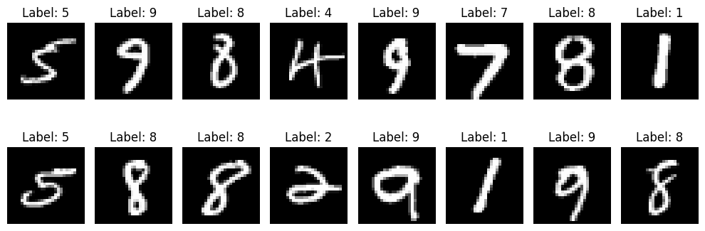
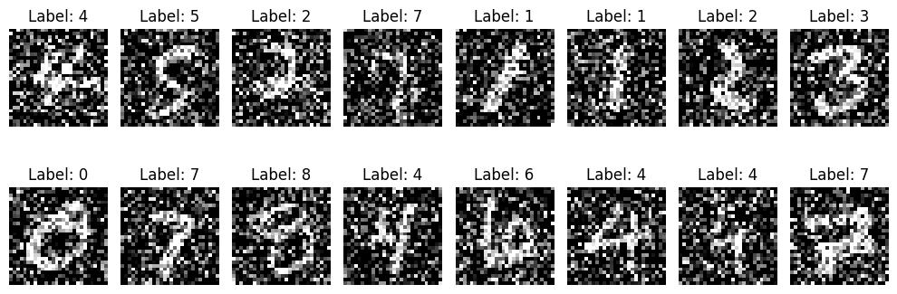
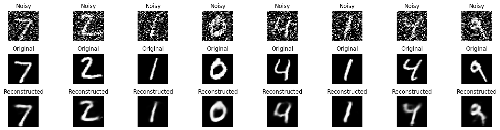

## Denoising Autoencoders

### What Is a Denoising Autoencoder?

A denoising autoencoder (DAE) is a type of autoencoder that learns to reconstruct the original, clean input from a corrupted (noisy) version of it.

Unlike the vanilla autoencoder, which sees clean inputs and tries to reproduce them, a DAE is trained to:

> Input: A noisy image

> Target: The clean image

This forces the model to learn more robust and meaningful representations, it can’t just memorize pixel patterns, it has to understand the structure of the data to clean it up.

---

### Why Add Noise?

Adding noise helps the autoencoder:

* Generalize better instead of overfitting
* Denoise real-world images (e.g., removing artifacts or occlusions)
* Learn feature representations that are stable and invariant

This also makes DAEs useful for pretraining deeper networks or for feature extraction.

---

### Types of Noise Used

In our notebook, we implemented two types of input corruption:

#### 1. **Gaussian Noise**

Adds random values from a normal distribution to the input:

```python
noisy = x + noise_factor * N(0, 1)
```

This simulates sensor noise or natural distortions.

#### 2. **Masking Noise**

Randomly zeroes out a fraction of the input pixels:

```python
x[mask == 0] = 0
```

This simulates occlusions or missing pixels.

---

### How It Works in Training

During training:

* We apply noise only to the inputs.
* The target remains the original clean image.
* The model learns to undo the noise through reconstruction.

---

## CODE AND EXPLANATION

You can explore the notebook here:

- 📘 <a href="https://github.com/Tony-Ale/Notebooks/blob/main/Denoising_Autoencoder.ipynb" target="_blank">View on GitHub</a>  
- 🚀 <a href="https://colab.research.google.com/github/Tony-Ale/Notebooks/blob/main/Denoising_Autoencoder.ipynb" target="_blank">Open in Colab</a>
---

### First of all load the dataset 

```python
# =======================
# Load the MNIST handwritten digit dataset and return DataLoaders for training and testing.
# Each image is converted to a PyTorch tensor and normalized to the [0, 1] range.
# DataLoaders enable efficient batching, shuffling, and iteration during training.
# =======================
from torchvision import datasets, transforms # Import MNIST dataset and image transforms
from torch.utils.data import DataLoader # For batching and loading the dataset

def get_mnist_loaders(batch_size=128):

  # Convert images to PyTorch tensors with values scaled to [0, 1]
  transform = transforms.ToTensor()

  # Download and load the training dataset
  train_dataset = datasets.MNIST(root='./data', train=True, download=True, transform=transform)

  # Download and load the test dataset
  test_dataset = datasets.MNIST(root='./data', train=False, download=True, transform=transform)

  # Wrap datasets in DataLoaders to enable batching and shuffling
  train_loader = DataLoader(train_dataset, batch_size=batch_size, shuffle=True)
  test_loader = DataLoader(test_dataset, batch_size=batch_size, shuffle=False)

  return train_loader, test_loader

```
---

### Write helper code to visualize data set

```python
# =======================
# Visualize a batch of MNIST digit images from the training dataset.
# This function loads a mini-batch using get_mnist_loaders() and displays the digits with their labels.
# Useful for quickly inspecting the raw input data before training.
# =======================
import matplotlib.pyplot as plt # For plotting and displaying images
def visualize_batch(batch_size=16):
  # Load a mini-batch of training data
  train_loader, _ = get_mnist_loaders(batch_size)
  images, labels = next(iter(train_loader)) # Get the first batch

  # Create a horizontal grid of images
  plt.figure(figsize=(10, 4))
  for i in range(batch_size):
    plt.subplot(2, batch_size // 2, i + 1) # 2 rows, batch_size/2 columns
    plt.imshow(images[i][0], cmap='gray') # Show the image (channel 0 since MNIST is grayscale)
    plt.title(f"Label: {labels[i].item()}")
    plt.axis('off')
  plt.tight_layout()
  plt.show()
```


```python
visualize_batch()
```

    100%|██████████| 9.91M/9.91M [00:00<00:00, 22.5MB/s]
    100%|██████████| 28.9k/28.9k [00:00<00:00, 622kB/s]
    100%|██████████| 1.65M/1.65M [00:00<00:00, 5.60MB/s]
    100%|██████████| 4.54k/4.54k [00:00<00:00, 5.22MB/s]


    

    

---

### Functions to add noise to the images.

```python
# Add noise to the image
import torch
import torch.nn as nn

def add_gaussian_noise(x, noise_factor=0.5):
    noise = torch.randn_like(x) * noise_factor
    x_noisy = x + noise
    return torch.clamp(x_noisy, 0., 1.)

def add_masking_noise(x, mask_prob=0.5):
    mask = (torch.rand_like(x) > mask_prob).float()
    return x * mask
```

---

### Visualize noisy images

```python
def visualize_noisy_batch(batch_size=16):
  # Load a mini-batch of training data
  train_loader, _ = get_mnist_loaders(batch_size)
  images, labels = next(iter(train_loader)) # Get the first batch
  images = add_gaussian_noise(images) # add noise to the image
  #images = add_masking_noise(images) # add noise to the image

  # Create a horizontal grid of images
  plt.figure(figsize=(10, 4))
  for i in range(batch_size):
    plt.subplot(2, batch_size // 2, i + 1) # 2 rows, batch_size/2 columns
    plt.imshow(images[i][0], cmap='gray') # Show the image (channel 0 since MNIST is grayscale)
    plt.title(f"Label: {labels[i].item()}")
    plt.axis('off')
  plt.tight_layout()
  plt.show()

visualize_noisy_batch()
```


    

    

---

### Set up the model architecture

```python
# =======================
# Define a fully-connected Autoencoder for compressing and reconstructing MNIST digit images.
# Architecture:
#   Encoder: 784 → 128 → 32
#   Decoder: 32 → 128 → 784
# The model learns to compress 28x28 images into a 32-dimensional latent space and reconstruct them.
# =======================

class Autoencoder(nn.Module):
    def __init__(self, input_dim=784, hidden_dim=128, latent_dim=32):
      super().__init__()

      # Encoder: compress input image to a 32-dimensional latent vector
      self.encoder = nn.Sequential(
          nn.Linear(input_dim, hidden_dim), # Flattened image → hidden layer
          nn.ReLU(),
          nn.Linear(hidden_dim, latent_dim), # Hidden → latent representation
      )

      # Decoder: reconstruct image from the latent vector
      self.decoder = nn.Sequential(
          nn.Linear(latent_dim, hidden_dim), # Latent → hidden layer
          nn.ReLU(),
          nn.Linear(hidden_dim, input_dim), # Hidden → reconstructed image
          nn.Sigmoid(),  # Match MNIST pixel range [0, 1]
      )

    def forward(self, x):
      x = x.view(x.size(0), -1) # Flatten image: [batch, 1, 28, 28] → [batch, 784]
      z = self.encoder(x) # Encode to latent vector
      out = self.decoder(z) # Decode back to reconstructed image
      return out
```

---

### Run the dataset loader function

```python
train_loader, test_loader = get_mnist_loaders()
```
---

### Initialize the model

```python
# initialize model
model = Autoencoder()
device = torch.device("cuda" if torch.cuda.is_available() else "cpu")
model.to(device)
```


    Autoencoder(
      (encoder): Sequential(
        (0): Linear(in_features=784, out_features=128, bias=True)
        (1): ReLU()
        (2): Linear(in_features=128, out_features=32, bias=True)
      )
      (decoder): Sequential(
        (0): Linear(in_features=32, out_features=128, bias=True)
        (1): ReLU()
        (2): Linear(in_features=128, out_features=784, bias=True)
        (3): Sigmoid()
      )
    )


---

### Set up loss function

```python
# set up loss function
criterion = nn.MSELoss()
optim = torch.optim.Adam(model.parameters(), lr=0.001)
```

---

### Train the model

```python
# Train the model
epochs = 10
model.train()
for epoch in range(epochs):
  running_loss = 0.0
  for data in train_loader:
    inputs, _ = data
    inputs = inputs.to(device)
    noisy_inputs = add_gaussian_noise(inputs)
    optim.zero_grad()
    outputs = model(noisy_inputs)
    loss = criterion(outputs, inputs.view(inputs.size(0), -1))
    loss.backward()
    optim.step()
    running_loss += loss.item()
  print(f'Epoch {epoch + 1}/{epochs}, Avg Loss: {running_loss / len(train_loader)}')

```

    Epoch 1/10, Avg Loss: 0.016572071163893254
    Epoch 2/10, Avg Loss: 0.016484482414416794
    Epoch 3/10, Avg Loss: 0.016438477628949736
    Epoch 4/10, Avg Loss: 0.01635536632693208
    Epoch 5/10, Avg Loss: 0.01629524039370673
    Epoch 6/10, Avg Loss: 0.016260576140540623
    Epoch 7/10, Avg Loss: 0.01620900532655688
    Epoch 8/10, Avg Loss: 0.016135096077376336
    Epoch 9/10, Avg Loss: 0.016106474781230187
    Epoch 10/10, Avg Loss: 0.016029552288496417


---

### Test the model

```python
# Test the model
model.eval()
with torch.no_grad():
  test_loss = 0.0
  for data in test_loader:
    inputs, _ = data
    inputs = inputs.to(device)
    noisy_inputs = add_gaussian_noise(inputs)
    outputs = model(noisy_inputs)
    loss = criterion(outputs, inputs.view(inputs.size(0), -1))
    test_loss += loss.item()
  print(f'Test Loss: {test_loss / len(test_loader)}')
```

    Test Loss: 0.015781743982453134


--- 

### Visualize noisy and reconstructed image

```python
# Visualize noisy and reconstructed image
model.eval()
with torch.no_grad():
    sample_imgs, _ = next(iter(test_loader))
    noisy_imgs = add_gaussian_noise(sample_imgs)
    noisy_imgs = noisy_imgs.to(device)
    reconstructed = model(noisy_imgs)

# Plot Noisy vs reconstructed
n = 8
plt.figure(figsize=(16, 4))
for i in range(n):
    # Noisy
    plt.subplot(3, n, i + 1)
    plt.imshow(noisy_imgs[i][0].cpu(), cmap='gray')
    plt.title("Noisy")
    plt.axis('off')

    # Original
    plt.subplot(3, n, i + 1 + n)
    plt.imshow(sample_imgs[i][0].cpu(), cmap='gray')
    plt.title("Original")
    plt.axis('off')

    # Reconstructed
    plt.subplot(3, n, i + 1 + 2*n)
    plt.imshow(reconstructed[i].view(28, 28).cpu(), cmap='gray')
    plt.title("Reconstructed")
    plt.axis('off')

plt.tight_layout()
plt.show()

```


    

    


