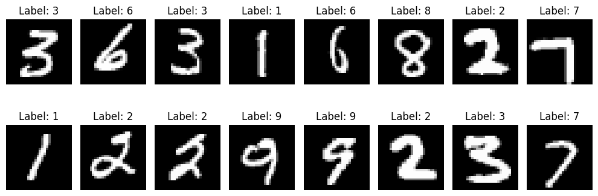
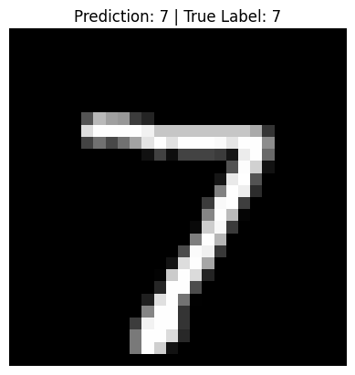

# GRUs: How Gated Recurrent Units Remember What Matters

You’ve probably seen how a basic Recurrent Neural Network (RNN) works, taking in sequences one step at a time and trying to learn patterns over time. But here's the catch: RNNs struggle with remembering information from far back in the sequence. Ever heard of the vanishing gradient problem? That’s one of the reasons.

The Gated Recurrent Unit, or GRU. GRUs are like RNNs but smarter. They know when to remember, when to forget, and when to update their memory. Think of them as memory-enhanced RNNs, designed to hold onto important information just long enough to make better predictions.

> 📚 *If you're new to this topic, you might want to check out my post on [Recurrent Neural Networks (RNNs)](https://tony-ale.github.io/blog_posts/post.html?post=RNN.md) first, it lays the foundation for what we’re about to explore.*

---

## From RNNs to GRUs: What’s the Problem?

In a vanilla RNN, the hidden state at time $t$, denoted $a^{\langle t \rangle}$, is computed as:

$$
a^{\langle t \rangle} = \tanh(W_a [a^{\langle t-1 \rangle}, x^{\langle t \rangle}] + b_a)
$$

This state can be passed to the next timestep or through a softmax layer to make a prediction $\hat{y}^{\langle t \rangle}$. While this design works, it often forgets important earlier information due to the vanishing gradient problem.

To fix this, GRUs introduce a memory cell, a way to keep essential information flowing through the network even across long sequences.

---

## Meet the Memory Cell: $c^{\langle t \rangle}$

In a GRU, the hidden state and the memory cell are the same:

$$
a^{\langle t \rangle} = c^{\langle t \rangle}
$$

We’ll treat them as different symbols for now, because in LSTMs, these will be different values.

---

## Step-by-Step: How GRU Works

Let’s break it down into three main steps:

### 1. Candidate Memory: What Should the Cell Value Be?

We compute a candidate value $\tilde{c}^{\langle t \rangle}$, which might replace the current memory:

$$
\tilde{c}^{\langle t \rangle} = \tanh(W_c [\Gamma_r * c^{\langle t-1 \rangle}, x^{\langle t \rangle}] + b_c)
$$

This uses the reset gate $\Gamma_r$ to decide how much of the previous memory to consider. We'll define $\Gamma_r$ soon.

---

### 2. Update Gate: Should We Replace the Old Memory?

The update gate $\Gamma_u \in [0, 1]$ controls whether to keep the old memory or use the candidate:

$$
c^{\langle t \rangle} = \Gamma_u * \tilde{c}^{\langle t \rangle} + (1 - \Gamma_u) * c^{\langle t-1 \rangle}
$$

Think of $\Gamma_u$ as a switch:

* If $\Gamma_u = 1$, we completely replace the memory with $\tilde{c}$
* If $\Gamma_u = 0$, we keep the previous memory

In practice, $\Gamma_u$ is computed as:

$$
\Gamma_u = \sigma(W_u [c^{\langle t-1 \rangle}, x^{\langle t \rangle}] + b_u)
$$

Where $\sigma$ is the sigmoid function:

$$
\sigma(z) = \frac{1}{1 + e^{-z}}
$$

This ensures $\Gamma_u$ is between 0 and 1, and often very close to either end; so it acts like a binary switch.

---

### 3. Reset Gate: How Much of the Past Should We Use?

The reset gate $\Gamma_r$ controls how much of the old memory to include when creating the new candidate:

$$
\Gamma_r = \sigma(W_r [c^{\langle t-1 \rangle}, x^{\langle t \rangle}] + b_r)
$$

This allows the network to selectively ignore irrelevant past information.

---

## Full GRU Equations

Putting it all together, a GRU is defined by:

$$
\Gamma_u = \sigma(W_u [c^{\langle t-1 \rangle}, x^{\langle t \rangle}] + b_u)
$$

$$
\Gamma_r = \sigma(W_r [c^{\langle t-1 \rangle}, x^{\langle t \rangle}] + b_r)
$$

$$
\tilde{c}^{\langle t \rangle} = \tanh(W_c [\Gamma_r * c^{\langle t-1 \rangle}, x^{\langle t \rangle}] + b_c)
$$

$$
c^{\langle t \rangle} = \Gamma_u * \tilde{c}^{\langle t \rangle} + (1 - \Gamma_u) * c^{\langle t-1 \rangle}
$$

And since $a^{\langle t \rangle} = c^{\langle t \rangle}$, this is also the output of the hidden layer.

---

## Visual Intuition: What’s Happening?

Imagine a sentence:

> "The **cat** that was hungry **was** full."

To decide whether to use *"was"* or *"were"*, you need to remember that *"cat"* is singular, even after reading many words in between. GRUs can hold that memory because:

* At *"cat"*, the update gate $\Gamma_u$ becomes 1; storing the "singular" bit.
* In between the words *"cat"* and *"was"*, $\Gamma_u$ becomes 0; preserving the memory.
* At *"was"*, the network can use this stored info to make the right choice.

---

## Element-wise Updates

In practice, the cell state $c^{\langle t \rangle}$ is a vector, say of size 100. The update gate $\Gamma_u$ is also a 100-dimensional vector, deciding per-dimension which memory bits to update or preserve.

This means GRUs can:

* Update some aspects of memory while keeping others intact
* Track multiple kinds of information in parallel (like grammar, context, etc.)

---

## CODE AND EXPLANATION

You can explore the notebook here:

- 📘 <a href="https://github.com/Tony-Ale/Notebooks/blob/main/GRU.ipynb" target="_blank">View on GitHub</a>  
- 🚀 <a href="https://colab.research.google.com/github/Tony-Ale/Notebooks/blob/main/GRU.ipynb" target="_blank">Open in Colab</a>
---

### First of all load the dataset 

```python
from torchvision import datasets, transforms
from torch.utils.data import DataLoader

def get_mnist_loaders(batch_size=32):
  transform = transforms.ToTensor()
  train_dataset = datasets.MNIST(root="./data", train=True, download=True, transform=transform)

  test_dataset = datasets.MNIST(root="./data", train=False, download=True, transform=transform)

  train_loader = DataLoader(train_dataset, batch_size=batch_size, shuffle=True)
  test_loader = DataLoader(test_dataset, batch_size=batch_size, shuffle=False)
  return train_loader, test_loader
```
---

### Write helper code to visualize data set

```python
import matplotlib.pyplot as plt # For plotting and displaying images
def visualize_batch(batch_size=16):
  # Load a mini-batch of training data
  train_loader, _ = get_mnist_loaders(batch_size)
  images, labels = next(iter(train_loader)) # Get the first batch

  # Create a horizontal grid of images
  plt.figure(figsize=(10, 4))
  for i in range(batch_size):
    plt.subplot(2, batch_size // 2, i + 1) # 2 rows, batch_size/2 columns
    plt.imshow(images[i][0], cmap='gray') # Show the image (channel 0 since MNIST is grayscale)
    plt.title(f"Label: {labels[i].item()}")
    plt.axis('off')
  plt.tight_layout()
  plt.show()
```

```python
visualize_batch()
```

    100%|██████████| 9.91M/9.91M [00:11<00:00, 891kB/s] 
    100%|██████████| 28.9k/28.9k [00:00<00:00, 131kB/s]
    100%|██████████| 1.65M/1.65M [00:01<00:00, 1.07MB/s]
    100%|██████████| 4.54k/4.54k [00:00<00:00, 6.02MB/s]


    

    
---

```python
train_loader, test_loader = get_mnist_loaders(32)
```
---

### Set up a simple GRU cell 

```python
import torch
import torch.nn as nn
import torch.nn.functional as F
class GRUCell(nn.Module):
  def __init__(self, input_size, hidden_size) -> None:
    super().__init__()

    self.x_t = nn.Linear(input_size, hidden_size) # A data point in our case, an image pixel
    self.c_t = nn.Linear(hidden_size, hidden_size) # The memory cell (more like the activation since in GRUs a_t = c_t)

    self.x_t_r = nn.Linear(input_size, hidden_size) # Relevance matrix
    self.c_t_r = nn.Linear(hidden_size, hidden_size) # Relevance matrix

    self.x_t_u = nn.Linear(input_size, hidden_size) # Update matrix
    self.c_t_u = nn.Linear(hidden_size, hidden_size) # Update matrix
  def forward(self, x, c_t_prev):

    gamma_u = F.sigmoid(self.c_t_u(c_t_prev) + self.x_t_u(x)) # Update gate

    gamma_r = F.sigmoid(self.c_t_r(c_t_prev) + self.x_t_r(x)) # Relevance gate

    c_t_tilde = F.tanh(self.c_t(gamma_r * c_t_prev) + self.x_t(x)) # output

    c_t = gamma_u * c_t_tilde + (1 - gamma_u) * c_t_prev

    return c_t

```

---

### Custom GRU Implementation

```python
class GRU(nn.Module):
  def __init__(self, input_size, hidden_size, GRUCell=GRUCell) -> None:
    super().__init__()

    self.input_size = input_size
    self.hidden_size = hidden_size
    self.GRUCell = GRUCell(input_size, hidden_size)

  def forward(self, x):
    # using batch first [batch_size, seq_len, input_size]
    output = []
    batch_size, seq_len, _ = x.shape
    c_t = torch.zeros(batch_size, self.hidden_size).to(x.device) # c_t for one data point or pixel

    for i in range(seq_len): # iterating through each pixel

      c_t = self.GRUCell(x[:, i, :], c_t)

      output.append(c_t)

    return torch.stack(output), c_t

```
---

### Set up Digit classification GRU to train

```python
class DigitClassification(nn.Module):
  def __init__(self, input_size=28, hidden_size=128, output_size=10) -> None:
    super().__init__()

    self.gru = GRU(input_size, hidden_size)
    self.classifier = nn.Linear(hidden_size, output_size)

  def forward(self, x):
    x = x.view(x.shape[0], 28, 28)
    output, c_t = self.gru(x)
    out = self.classifier(c_t)
    return out
```

---

### Initialize model 

```python
criterion = nn.CrossEntropyLoss()
model = DigitClassification()
device = torch.device("cuda" if torch.cuda.is_available() else "cpu")
model.to(device)
optimizer = torch.optim.Adam(model.parameters(), lr=0.001)
```

---

### Train Model 

```python
epochs=10
for epoch in range(epochs):
  running_loss = 0.0
  for image, target in train_loader:
    image = image.to(device)
    target = target.to(device)

    optimizer.zero_grad()

    output = model.forward(image)
    loss = criterion(output, target)
    loss.backward()
    optimizer.step()
    running_loss += loss.item()

  print(f"Epoch: {epoch+1}, Loss: {running_loss/len(train_loader)}")

```

    Epoch: 1, Loss: 0.3821188646500309
    Epoch: 2, Loss: 0.09624521113932133
    Epoch: 3, Loss: 0.06622859690232823
    Epoch: 4, Loss: 0.05134889295408502
    Epoch: 5, Loss: 0.04086330350704181
    Epoch: 6, Loss: 0.034850305111209554
    Epoch: 7, Loss: 0.029862093949092863
    Epoch: 8, Loss: 0.024089865983087416
    Epoch: 9, Loss: 0.02408636848607954
    Epoch: 10, Loss: 0.020219191493724552

---

### Determine model accuracy

```python
# Test the accuracy of the model
model.eval()
with torch.no_grad():
  correct = 0
  total = 0
  for images, target in test_loader:
    images = images.to(device)
    target = target.to(device)

    output = model.forward(images)

    _, topk = output.topk(1, dim=1)

    topk = topk.squeeze(1)

    correct += (topk == target).sum()

    total += target.size(0)

  print(f"Accuracy: {100*correct/total}%")
```

    Accuracy: 98.75%

---

### Test Model 

```python
import matplotlib.pyplot as plt
import torchvision.transforms.functional as TF

# Set model to eval mode
model.eval()

# Get one batch from test_loader
images, labels = next(iter(test_loader))

# Pick one sample
index = 0
image = images[index].to(device).unsqueeze(0)  # Add batch dimension
label = labels[index]

# Make prediction
with torch.no_grad():
    output = model(image)
    _, pred = output.topk(1, dim=1)
    pred = pred.item()

# Show image
plt.imshow(TF.to_pil_image(images[index]), cmap="gray")
plt.title(f"Prediction: {pred} | True Label: {label.item()}")
plt.axis('off')
plt.show()
```


    

    

---

