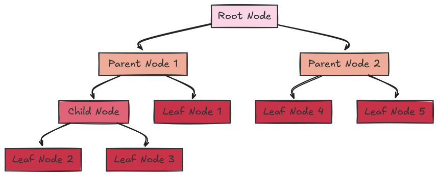
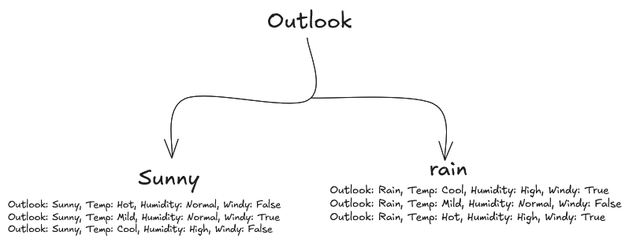

# Induction Trees Paper (ID3)

The ID3 Algorithm is part of the TDIDT family (Top-Down Induction of Decision Trees). The underlying strategy for algorithms in this family is non-incremental learning from examples. That is, the training data is one-shotted to the algorithm, and it represents the acquired knowledge as decision trees without taking into account the order in which the examples are passed to the algorithm.

Induction refers to the process of building a decision tree model by iteratively analyzing data and making decisions based on the informative features, essentially **"inferring"** the best way to classify new data points based on the patterns found in the training data. The essence of induction is to move beyond the training set—that is, to construct a decision tree that correctly classifies not only data from the training set but also other unseen data.

These systems or algorithms in this family are majorly used to develop decision trees for classification tasks. These trees are constructed beginning with the root of the tree, proceeding down to its leaves.

---

## Some CS Concepts



Before diving deeper, let's clarify some fundamental CS concepts.

In CS, a **tree** is a data structure that represents a hierarchical structure of nodes connected by edges.

- **Root Node**: The starting node or the first node; it has no parent node.
- **Parent Node**: A node that has at least one child node.
- **Child Node**: A node that is a descendant of another node.
- **Leaf Node**: A node that does not have any child nodes.

---

## How Does Induction Work?

Okay, let's get back on track. How does induction work? Let's say we've got a set of weather data and we want to determine, based on the weather data, if a day is suitable for skydiving or not.

A typical data point could be the following:

### Attributes and Their Possible Values:
- **Outlook**: {sunny, rain}
- **Temperature**: {cool, mild, hot}
- **Humidity**: {high, normal}
- **Windy**: {true, false}

Example:
```plaintext
outlook: sunny, temperature: mild, humidity: normal, windy: false → class: True
```
*(meaning a day with these particular attributes is suitable for skydiving).*

Assuming we have several of these data points, with each point showing either `True` (suitable for skydiving) or `False` (terrible weather for skydiving), the induction task is to develop a classification rule that can determine the class of any data point from its values and attributes. 

If data points have identical values for each attribute and yet belong to different classes, it would be really difficult to differentiate between these data points using the given attributes only. In such cases, attributes are termed **inadequate** for the induction task.

---

## How Do I Select Parents for the Trees?

One important question you might be thinking is: *How does the algorithm decide which attribute to use as the root node or as a parent node?* Are they selected randomly?

Well, there is a formula called the **entropy formula**, introduced by Claude Shannon. This formula measures the information content of a variable.

### The Claude Shannon Entropy Formula:

$$ I(X) = - \sum_{i=1}^{n} p(x_i) \log_2 p(x_i) $$

Where:
- **I(x)** = The uncertainty of the variable; meaning that if the value of I(x) is low, that variable has a lot of information.
- **P(x)** = The probability of the variable.

For a decision tree having two classes, `p` and `n`, the information content of the tree is:

$$ I(p, n) = - \frac{p}{p+n} \log_2 \left( \frac{p}{p+n} \right) - \frac{n}{p+n} \log_2 \left( \frac{n}{p+n} \right) $$

This is just a summation of **I** for the `p` and `n` class.


#### Example: Selecting the Root Node



Let's consider the typical data point used previously. Suppose our algorithm decides that the `outlook` variable (`outlook` with values `{sunny, rain}`) should be the root node. Therefore, we would have the `outlook` variable branching out to `sunny` and `rain`. 

- Other data points where `outlook = sunny` will be camped under the `sunny` branch.
- Data points where `outlook = rain` will camp under the `rain` node.

To find the **expected information required** for the tree, we compute the sum of information content of the `sunny` and `rain` branches. To make the sum more accurate, we use **weighted averaging**, since some branches could have a large number of data points while others have fewer.

In general, we compute a weighted average of information content across branches:

$$ E(A) = \sum_{i=1}^{v} \frac{p_i + n_i}{p+n} \cdot I(p_i, n_i) $$

Where:
- **E(A)** is the expected information required for the tree with `A` as the root (in our case, `outlook`).

Thus, the **information gain** by branching on `A` (outlook) is:

$$ 
\text{gain}(A) = I(p, n) - E(A) 
$$

This variable `gain(A)` determines whether an attribute should be a root or parent. For example, in our dataset, we calculate the gain for each attribute, and the attribute with the **highest gain** will be selected as the **root node**. The same method is applied to determine subsequent parent nodes.

---

## Bias of Gain Criterion

It was noticed that the Gain criterion tends to favor attributes with many values, especially because E(A) is the sum of information gained across all the values/branches. This makes sense because having more information about something should help classify it more accurately. However, sometimes the information may be false or not useful, which is why we want to reduce the gain bias due to numerous values.  

#### Example:
Imagine we have a dataset to classify animals based on attributes like color and size.

**Initial Attribute (A): Color**  
Possible values: Red, Blue, Green, Yellow  
Let's assume the dataset works well for the induction task at hand.

The gain criterion calculates the information gain for "Color" based on the reduction in entropy.

**Refined Attribute (A'): Color Split**  
Suppose we split one of the colors (e.g., Red) into two new values: Dark Red and Light Red.

Now, we have more values: Dark Red, Light Red, Blue, Green, Yellow.

**Problem with Gain Criterion:**  
The gain criterion would generally calculate a higher gain for the refined attribute (A') because it has more values.

**Information Gain for (A'):**  
The refinement creates a perception of a more informative attribute because the information gain (gain(A')) would be greater than or equal to the gain(A).

However, this higher gain doesn't necessarily mean better classification performance. Instead, it might obscure the underlying structure of the dataset.

There are several key suggestions for reducing the bias of the gain criterion. One such technique is restricting every attribute to have only two outcomes/values. For example, if an attribute has values A1, A2, A3, A4, the tree won't have a branch for each value. Instead, a subset S of the values is chosen, and the tree has two branches: one for all values in the subset and another for the remainder. In our example, the two branches could be {A1, A2} and {A3, A4}. Although this idea gives better classification results and produces smaller decision trees, a lot of the time, it performs poorly and does not generalize well.

For this blog, we will be using the idea of **gain-ratio** to reduce the bias of the gain criterion.

Simply, the gain-ratio is defined as:

$$ \text{Gain-Ratio} = \frac{\text{Gain}(A)}{IV(A)} $$

where IV(A) (Intrinsic Value) is the information content of the root attribute with respect to the whole data points or the decision tree. In the formula below, notice how the probabilities are calculated based on the sum of the total data points p and n:

$$ IV(A) = \sum_{i=1}^{v} \frac{p_i + n_i}{p+n} \log_2 \left( \frac{p_i + n_i}{p+n} \right) $$

---

## Dealing with Noise in Data
So far, there has been an unconscious assumption that our training sets or data points will be entirely accurate. But sadly, real-world data is filled with noise. The surprising thing here is that having noise in your data can actually make your tree better at classification. This is because when the tree is tested in a real-world environment or used in production, it will be applied to noisy data. So, if you train your decision tree with perfectly clean data, it will not generalize well for real-world cases.

To have a good model/tree, there should be a balance between noisy data and clean data. If your dataset is too noisy, your model or tree will perform poorly in all cases.

To deal with noise, there is a method based on the chi-square test for stochastic independence. Now, that may sound complex, so let me explain in simpler terms. The **chi-square test** is used for two categorical variables (e.g., our "Outlook" attribute is categorical, with categories like sunny and rainy). It is used to test if two variables, such as outlook and temperature, are dependent or related. To deal with noisy data, we want to test if an attribute A helps in the classification process.

The chi-square test formula is:

$$ \chi^2 = \sum_{i=1}^{v} \left( \frac{(p_i - p_i')^2}{p_i'} + \frac{(n_i - n_i')^2}{n_i'} \right) $$

where:
- $p_i$ is the observed number of positive classes for a branch of an attribute.
- $p_i'$ is the expected number of positive classes for a branch of an attribute.
- $n_i$ is the observed number of negative classes.
- $n_i'$ is the expected number of negative classes.

If A is irrelevant, then the distribution of positive and negative instances in each subset or branch should match the overall distribution in the entire dataset.

With this assumption, our expected number of positive classes will be:

$$ p_i' = \frac{p \cdot (p_i + n_i)}{p + n} $$

## UNKOWN ATTRIBUTE STRATEGY
Alright, so far we've figured out how to select an attribute, how to reduce bias when selecting an attribute and how do handle noise in your dataset, but how do you handle cases whereby an attribute is unknown or missing? because in real world data, some training data will be incomplete, inference data could also be incomplete. so how do we handle such cases

## 1. Unknown attribute strategy During Training (evaluating information gain)
In this case the aim is to calculate gain with an updated value of pi; pi is updated by distributing the datapoints with unknown values across the known values of an attribute
#### Adjusted Count Formula
The adjusted count is calculated using the following formula:

$$
\text{Adjusted p}_i = p_i + p_u \cdot \text{ratio}_i
$$

where:

$$
\text{ratio}_i = \frac{p_i + n_i}{\sum (p_i + n_i)}
$$

Let's consider the following training dataset for fruit classification:

| Fruit  | Color  | Size  | Shape  | Class |
|--------|--------|-------|--------|-------|
| Apple  | Red    | Small | Round  | P     |
| Banana | ?      | Large | Long   | P     |
| Cherry | Red    | Small | Round  | P     |
| Grape  | Green  | Small | Round  | P     |
| Lemon  | Yellow | Small | Round  | N     |
| Lime   | ?      | Small | Round  | N     |
| Orange | Orange | Large | Round  | P     |
| Pear   | Green  | Large | Round  | P     |

In this example, the "Color" attribute is missing (unknown, denoted by "?") for both Banana and Lime. We want to use these unknown values when computing the information gain for the attribute "Color" during training.

### Step 1: Determine the Known Value Frequencies
Among the fruits with known Color values (Apple, Cherry, Grape, Lemon, Orange, Pear), the counts are:

- **Red**: Apple and Cherry → count = 2
- **Green**: Grape and Pear → count = 2
- **Yellow**: Lemon → count = 1
- **Orange**: Orange → count = 1
- **Total number of examples with known Color** = 6.

### Step 2: Compute the Proportions for Each Color
Using the known counts, the relative frequencies (proportions) are:

- **Red**: $\frac{2}{6} \approx 0.333$
- **Green**: $\frac{2}{6} \approx 0.333$
- **Yellow**: $\frac{1}{6} \approx 0.167$
- **Orange**: $\frac{1}{6} \approx 0.167$

### Step 3: Distribute the Unknowns Proportionally
There are 2 examples with unknown Color (Banana and Lime). We distribute these unknowns in proportion to the known frequencies:

- **Additional count for Red**: $2 \times 0.333 \approx 0.667$
- **Additional count for Green**: $2 \times 0.333 \approx 0.667$
- **Additional count for Yellow**: $2 \times 0.167 \approx 0.333$
- **Additional count for Orange**: $2 \times 0.167 \approx 0.333$

### Step 4: Compute the Effective Counts
Now add these fractional counts to the known counts to get the effective counts used in entropy and information gain calculations:

- **Red**: $2 + 0.667 = 2.667$
- **Green**: $2 + 0.667 = 2.667$
- **Yellow**: $1 + 0.333 = 1.333$
- **Orange**: $1 + 0.333 = 1.333$

The total effective count is $2.667 + 2.667 + 1.333 + 1.333 = 8$, which now includes all 8 examples (6 with known values plus the 2 unknowns "fractionally" allocated).

Once the best attribute is selected using this adjusted count, the objects/datapoints with unknown values for that attribute are dropped for building the subsequent subtrees.

## 2. Unknown attribute strategy during classification/inference
For a case whereby during inference, the input to the model has unknown attributes, this is how you will handle it
you will be using this formula

$$
\text{Token} \cdot \text{ratio}_i
$$


Let's say we’ve already built a decision tree from the following training dataset:

| Fruit  | Color  | Size  | Shape | Class |
|--------|--------|-------|-------|-------|
| Apple  | Red    | Small | Round | P     |
| Banana | Yellow | Large | Long  | P     |
| Cherry | Red    | Small | Round | P     |
| Grape  | Green  | Small | Round | P     |
| Lemon  | Yellow | Small | Round | N     |
| Lime   | Green  | Small | Round | N     |
| Orange | Orange | Large | Round | P     |
| Pear   | Green  | Large | Round | P     |

Suppose that in our decision tree the first split is on **Color** and the second split (for each Color branch) is on **Size**. For simplicity, assume that the tree’s leaves (after the Size test) are pure (i.e. they directly assign a class).

Now, consider classifying a new instance (a “Mystery Fruit”) that has an unknown value for **Color** and, further down the tree, an unknown value for **Size**. We’ll see how the algorithm “splits” the classification token at each unknown.

### Step 1. Distribute Token at the Color Node
From the training data (ignoring the Fruit names), the distribution of known Color values is:

- **Red:** Apple, Cherry → count = 2  
- **Yellow:** Banana, Lemon → count = 2  
- **Green:** Grape, Lime, Pear → count = 3  
- **Orange:** Orange → count = 1  
  
Total examples with known Color = **8**.

So the proportions are:

- **Red:** 2/8 = **0.25**  
- **Yellow:** 2/8 = **0.25**  
- **Green:** 3/8 = **0.375**  
- **Orange:** 1/8 = **0.125**  
  
Since the new instance’s **Color** is unknown, we split its token (starting Token = 1) across all Color branches:

- **Red branch:** token = 1 × 0.25 = **0.25**  
- **Yellow branch:** token = 1 × 0.25 = **0.25**  
- **Green branch:** token = 1 × 0.375 = **0.375**  
- **Orange branch:** token = 1 × 0.125 = **0.125**  

### Step 2. Distribute Token at the Size Node (Second Unknown)
Next, each Color branch splits on **Size**. Suppose the Size distribution within each branch (based on the training examples that reached that branch) is as follows:

#### **Red branch:**
- Training examples: **Apple** and **Cherry**, both with Size = **Small**.
- So, for **Red**: All known examples are **Small** (**100%**).
- When Size is unknown: All of the **0.25** token goes to the “Small” leaf (which predicts **Class P**).

#### **Yellow branch:**
- Training examples: **Banana (Large, P)** and **Lemon (Small, N)**.
- Proportions: **50% Large, 50% Small**.
- So the **0.25** token is split as:
  - **Large** branch: 0.25 × 0.5 = **0.125** (predicts **P**)
  - **Small** branch: 0.25 × 0.5 = **0.125** (predicts **N**)

#### **Green branch:**
- Training examples: **Grape (Small, P), Lime (Small, N), and Pear (Large, P)**.
- Proportions: **Small = 2/3 ≈ 0.667; Large = 1/3 ≈ 0.333**.
- So the **0.375** token is split as:
  - **Small** branch: 0.375 × 0.667 ≈ **0.25**
  - **Large** branch: 0.375 × 0.333 ≈ **0.125**
- For class assignment, assume the tree (by tie-break or majority) assigns:
  - **Small branch → Class P**
  - **Large branch → Class P**

#### **Orange branch:**
- Training examples: **Only Orange**, which is **Large** and **Class P**.
- So, for **Orange**, all of the **0.125** token goes to the **Large** branch (predicts **P**).

### Step 3. Sum Up the Fractional Votes at the Leaves
Now, each branch has reached a leaf (after the Size test):

#### **Red branch:**
- **Small leaf (P):** receives **0.25**

#### **Yellow branch:**
- **Large leaf (P):** receives **0.125**
- **Small leaf (N):** receives **0.125**

#### **Green branch:**
- **Small leaf (P):** receives **0.25**
- **Large leaf (P):** receives **0.125**

#### **Orange branch:**
- **Large leaf (P):** receives **0.125**

Now sum the votes by class:

**Class P:**
- Red: **0.25**
- Yellow: **0.125**
- Green: **0.25 + 0.125 = 0.375**
- Orange: **0.125**
- **Total for P: 0.25 + 0.125 + 0.375 + 0.125 = 0.875**

**Class N:**
- Yellow **Small** leaf: **0.125**
- **Total for N: 0.125**

#### Final Decision:
Since the summed token weight for **Class P (0.875)** is much higher than for **Class N (0.125)**, the new instance is classified as **Class P**.

So yeah that is pretty much it. This is everything you need to know about decision trees.
