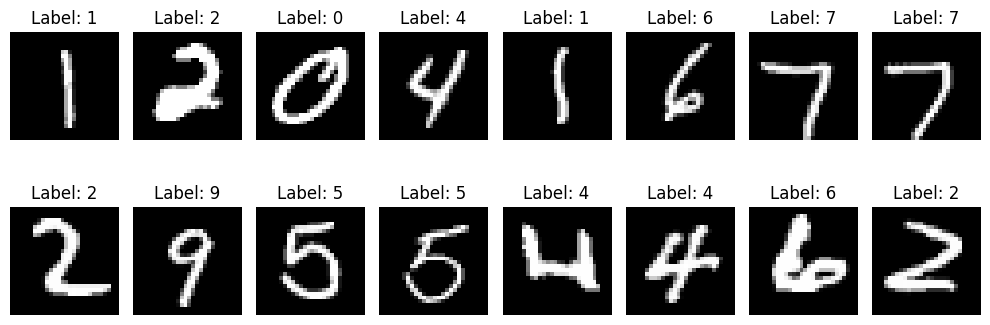
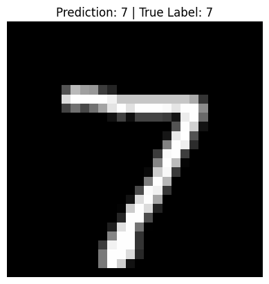

# Understanding LSTMs: The Powerhouse of Sequence Learning

In the world of deep learning, LSTMs (Long Short-Term Memory units) are one of the most powerful tools we have for modeling sequences whether that’s text, time series, music, or speech. If you’ve ever wondered how machines understand sentences, generate poetry, or predict stock prices over time, LSTMs have probably played a part.

In a previous post, we talked about GRUs (Gated Recurrent Units), which are already pretty smart. But now we’re diving into something even more powerful: LSTMs. Buckle up we’re going to break it down simply and visually so that even if you’re new to this, it’ll stick.

---

## Why Do We Need LSTMs?

A big challenge in training neural networks on sequences is the vanishing gradient problem older inputs get "forgotten" as the sequence grows. GRUs and LSTMs were both designed to solve this by giving the network a way to remember important things for a long time.

While GRUs do this with two gates, LSTMs go one step further with three gates, giving them more control over memory.

The LSTM paper was published way back in 1997, making it one of the earliest architectures to address this memory retention problem. Much later, in 2014, the GRU was introduced as a simpler alternative to LSTMs. GRUs aim to achieve similar performance but with fewer parameters and reduced computational overhead, making them faster to train in some settings.

While GRUs are leaner, LSTMs are more flexible with an extra gate and separate memory cell, they give you more control over what the model remembers and forgets.

---

## The LSTM Equations: What’s Going On?

Let’s start by looking at the key components of the LSTM. At each time step $t$, we maintain:

* $\mathbf{c}_t$: the cell state, or memory
* $\mathbf{a}_t$: the output, also called the hidden state

We also compute three gates, these are like switches that decide what to forget, what to update, and what to reveal.

1. Forget Gate
   This decides what parts of the old memory to forget:
    <div>
        $$
        \Gamma_f = \sigma(\mathbf{W}_f [\mathbf{a}_{t-1}, \mathbf{x}_t] + \mathbf{b}_f)
        $$
    </div>

2. Update Gate (also called the input gate)
   This decides what new information to store in memory:
    <div>
    $$
    \Gamma_u = \sigma(\mathbf{W}_u [\mathbf{a}_{t-1}, \mathbf{x}_t] + \mathbf{b}_u)
    $$
   </div>

3. Candidate Memory
   A potential new memory value, computed like a tanh-squashed suggestion:

    <div>
    $$
    \tilde{\mathbf{c}}_t = \tanh(\mathbf{W}_c [\mathbf{a}_{t-1}, \mathbf{x}_t] + \mathbf{b}_c)
    $$
   </div>

Now we update the memory:
<div>
$$
\mathbf{c}_t = \Gamma_f \odot \mathbf{c}_{t-1} + \Gamma_u \odot \tilde{\mathbf{c}}_t
$$
</div>

Here, $\odot$ means element-wise multiplication.

4. Output Gate
   This decides what part of the memory we output:

    <div>
    $$
    \Gamma_o = \sigma(\mathbf{W}_o [\mathbf{a}_{t-1}, \mathbf{x}_t] + \mathbf{b}_o)
    $$
   </div>

5. Final Output:

    <div>
    $$
    \mathbf{a}_t = \Gamma_o \odot \tanh(\mathbf{c}_t)
    $$
   </div>

So, unlike GRUs where $\mathbf{a}_t = \mathbf{c}_t$, LSTMs separate the memory ($\mathbf{c}_t$) and the output ($\mathbf{a}_t$). This gives LSTMs more flexibility.

---

## Visualizing the LSTM

Imagine a factory assembly line. At each station (time step), a worker receives:

* The previous state $\mathbf{a}_{t-1}$
* The current input $\mathbf{x}_t$

Together, they:

* Decide what to forget (Forget gate)
* Decide what to learn (Update gate)
* Propose a memory update ($\tilde{\mathbf{c}}_t$)
* Combine all that into the new memory ($\mathbf{c}_t$)
* Decide what to show as output (Output gate)

This pipeline helps the LSTM keep important information flowing for many steps, without losing it due to vanishing gradients.

---

## Why Is LSTM So Good at Remembering?

The secret weapon is the cell state $\mathbf{c}_t$, which acts like a conveyor belt running through the sequence. As long as the forget gate $\Gamma_f$ is set close to 1 and the update gate $\Gamma_u$ close to 0, the memory stays almost unchanged.

This means an LSTM can carry the same value over dozens (or hundreds) of steps, something traditional RNNs really struggled with.

---

## GRU or LSTM: Which Should You Use?

It’s like choosing between two great tools:

* GRUs are simpler (2 gates), faster, and easier to train
* LSTMs are more powerful (3 gates), more flexible, and better at long-term memory

Historically, LSTMs came first and have been more widely used. But GRUs are becoming more popular, especially in very deep networks where simplicity helps.

My take? If you’re starting out, go with LSTM, it’s a safe, well-tested choice. If you need faster training or want to build something very large, give GRUs a shot.

---

## CODE AND EXPLANATION

You can explore the notebook here:

- 📘 <a href="https://github.com/Tony-Ale/Notebooks/blob/main/LSTM.ipynb" target="_blank">View on GitHub</a>  
- 🚀 <a href="https://colab.research.google.com/github/Tony-Ale/Notebooks/blob/main/LSTM.ipynb" target="_blank">Open in Colab</a>


---

### First of all load the dataset 

```python
from torchvision import datasets, transforms
from torch.utils.data import DataLoader

def get_mnist_loaders(batch_size=32):
  transform = transforms.ToTensor()
  train_dataset = datasets.MNIST(root="./data", train=True, download=True, transform=transform)

  test_dataset = datasets.MNIST(root="./data", train=False, download=True, transform=transform)

  train_loader = DataLoader(train_dataset, batch_size=batch_size, shuffle=True)
  test_loader = DataLoader(test_dataset, batch_size=batch_size, shuffle=False)
  return train_loader, test_loader
```

---

### Write helper code to visualize data set

```python
import matplotlib.pyplot as plt # For plotting and displaying images
def visualize_batch(batch_size=16):
  # Load a mini-batch of training data
  train_loader, _ = get_mnist_loaders(batch_size)
  images, labels = next(iter(train_loader)) # Get the first batch

  # Create a horizontal grid of images
  plt.figure(figsize=(10, 4))
  for i in range(batch_size):
    plt.subplot(2, batch_size // 2, i + 1) # 2 rows, batch_size/2 columns
    plt.imshow(images[i][0], cmap='gray') # Show the image (channel 0 since MNIST is grayscale)
    plt.title(f"Label: {labels[i].item()}")
    plt.axis('off')
  plt.tight_layout()
  plt.show()
```


```python
visualize_batch()
```

    100%|██████████| 9.91M/9.91M [00:00<00:00, 55.7MB/s]
    100%|██████████| 28.9k/28.9k [00:00<00:00, 1.63MB/s]
    100%|██████████| 1.65M/1.65M [00:00<00:00, 14.1MB/s]
    100%|██████████| 4.54k/4.54k [00:00<00:00, 5.81MB/s]


    

    

---

```python
train_loader, test_loader = get_mnist_loaders()
```

---

### Set up a simple LSTM cell 


```python
import torch.nn as nn
import torch
class LSTMCell(nn.Module):
  def __init__(self, input_size, hidden_size):
    super().__init__()

    self.x_t = nn.Linear(input_size, hidden_size)
    self.a_t = nn.Linear(hidden_size, hidden_size)

    # Update gate params
    self.x_t_u = nn.Linear(input_size, hidden_size)
    self.a_t_u = nn.Linear(hidden_size, hidden_size)

    # Forget gate params
    self.x_t_f = nn.Linear(input_size, hidden_size)
    self.a_t_f = nn.Linear(hidden_size, hidden_size)

    # Output gate params
    self.x_t_o = nn.Linear(input_size, hidden_size)
    self.a_t_o = nn.Linear(hidden_size, hidden_size)
  def forward(self, x, a_t_prev, c_t_prev):
    gamma_u = torch.sigmoid(self.x_t_u(x) + self.a_t_u(a_t_prev)) # Update gate
    gamma_f = torch.sigmoid(self.x_t_f(x) + self.a_t_f(a_t_prev)) # forget gate
    gamma_o = torch.sigmoid(self.x_t_o(x) + self.a_t_o(a_t_prev)) # output gate

    c_t_tilde = torch.tanh(self.x_t(x) + self.a_t(a_t_prev))

    c_t = gamma_u * c_t_tilde + gamma_f * c_t_prev

    a_t = gamma_o * torch.tanh(c_t)

    return a_t, c_t
```

---

### Custom LSTM Implementation


```python
class LSTM(nn.Module):
  def __init__(self, input_size, hidden_size, LSTMCell=LSTMCell):
    super().__init__()
    self.hidden_size = hidden_size
    self.LSTMCell = LSTMCell(input_size, hidden_size)

  def forward(self, x):
    # Using batch first [batch_size, seq_len, input_size]

    output = []

    batch_size, seq_len, _ = x.shape

    a_t = torch.zeros(batch_size, self.hidden_size).to(x.device)
    c_t = torch.zeros(batch_size, self.hidden_size).to(x.device)

    for i in range(seq_len):
      a_t, c_t = self.LSTMCell(x[:, i, :], a_t, c_t)
      output.append(a_t)
    return torch.stack(output, dim=1), (a_t, c_t)


```
---

### Set up Digit classification LSTM to train

```python
class DigitClassification(nn.Module):
  def __init__(self, input_size, hidden_size, output_size):
    super().__init__()
    self.LSTM = LSTM(input_size, hidden_size)
    self.classifier = nn.Linear(hidden_size, output_size)
  def forward(self, x):
    x = x.view(-1, 28, 28)
    _, (a_t, c_t) = self.LSTM(x)
    out = self.classifier(a_t)
    return out
```

---

### Initialize model 


```python
model = DigitClassification(input_size=28, hidden_size=128, output_size=10)
device = torch.device("cuda" if torch.cuda.is_available() else "cpu")
model.to(device)
```


    DigitClassification(
      (LSTM): LSTM(
        (LSTMCell): LSTMCell(
          (x_t): Linear(in_features=28, out_features=128, bias=True)
          (a_t): Linear(in_features=128, out_features=128, bias=True)
          (x_t_u): Linear(in_features=28, out_features=128, bias=True)
          (a_t_u): Linear(in_features=128, out_features=128, bias=True)
          (x_t_f): Linear(in_features=28, out_features=128, bias=True)
          (a_t_f): Linear(in_features=128, out_features=128, bias=True)
          (x_t_o): Linear(in_features=28, out_features=128, bias=True)
          (a_t_o): Linear(in_features=128, out_features=128, bias=True)
        )
      )
      (classifier): Linear(in_features=128, out_features=10, bias=True)
    )

---

### Set up loss 

```python
criterion = nn.CrossEntropyLoss()
optimizer = torch.optim.Adam(model.parameters(), lr=0.001)
```


### Train Model 


```python
epochs = 10
for epoch in range(epochs):
  running_loss = 0.0
  for images, targets in train_loader:
    images = images.to(device)
    targets = targets.to(device)

    optimizer.zero_grad()
    outputs = model(images)
    loss = criterion(outputs, targets)
    loss.backward()
    optimizer.step()
    running_loss += loss.item()
  print(f"Epoch {epoch+1}/{epochs}, Loss: {running_loss/len(train_loader)}")

```

    Epoch 1/10, Loss: 0.35905330972671506
    Epoch 2/10, Loss: 0.11276032264816264
    Epoch 3/10, Loss: 0.07675111181475222
    Epoch 4/10, Loss: 0.05976210466306656
    Epoch 5/10, Loss: 0.04733304212416212
    Epoch 6/10, Loss: 0.03894993536525095
    Epoch 7/10, Loss: 0.033846180220491566
    Epoch 8/10, Loss: 0.029500325580965728
    Epoch 9/10, Loss: 0.02503393310982889
    Epoch 10/10, Loss: 0.02296483846361904


---

### Test the accuracy of the model

```python
# Test the accuracy of the model
model.eval()
with torch.no_grad():
  correct = 0
  total = 0
  for images, target in test_loader:
    images = images.to(device)
    target = target.to(device)

    output = model.forward(images)

    _, topk = output.topk(1, dim=1)

    topk = topk.squeeze(1)

    correct += (topk == target).sum()

    total += target.size(0)

  print(f"Accuracy: {100*correct/total}%")
```

    Accuracy: 98.7699966430664%

---

### Test the model

```python
import matplotlib.pyplot as plt
import torchvision.transforms.functional as TF

# Set model to eval mode
model.eval()

# Get one batch from test_loader
images, labels = next(iter(test_loader))

# Pick one sample
index = 0
image = images[index].to(device).unsqueeze(0)  # Add batch dimension
label = labels[index]

# Make prediction
with torch.no_grad():
    output = model(image)
    _, pred = output.topk(1, dim=1)
    pred = pred.item()

# Show image
plt.imshow(TF.to_pil_image(images[index]), cmap="gray")
plt.title(f"Prediction: {pred} | True Label: {label.item()}")
plt.axis('off')
plt.show()
```


