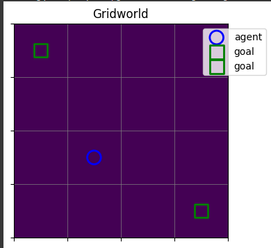
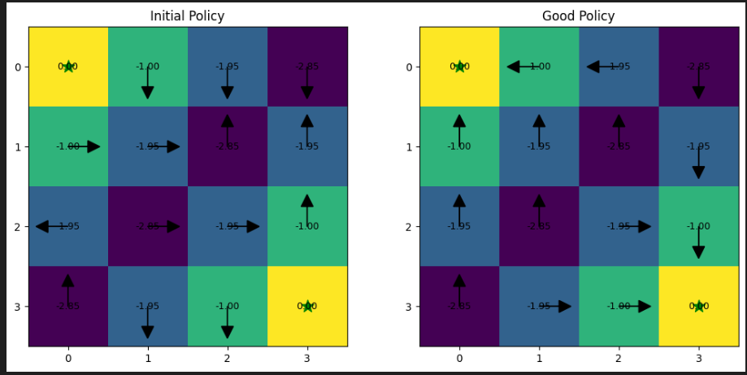

# POLICY EVALUATION AND ITERATION

Reinforcement Learning (RL) is a type of machine learning where an agent learns to make sequences of decisions by interacting with an environment. The learner and decision-maker is called the agent, and what the agent interacts with is called the environment. An agent takes actions in the environment, and for each action, the environment presents a new situation to the agent and also gives a reward for taking that action. The aim of the agent is to maximize the total reward over time through its actions.

Let’s assume the environment is a grid world, where the agent can only move up, down, left, or right. If the agent attempts to go outside the grid, nothing happens and it remains in its current position. If an agent spawns at any random cell position (initial state $S_0$) and decides to take an action $A_0$ by moving right, it finds itself in a new cell or state $S_1$ with a reward $R_1$. These interactions can be represented as a sequence:

$$
S_0, A_0, R_1, S_1, A_1, R_2, S_2, A_2, R_3, \dots
$$

Since the agent’s goal is to maximize cumulative returns, we can define the return as the sum of rewards:

$$
G_t = R_{t+1} + R_{t+2} + \dots + R_T
$$

However, if the agent interacts continuously without end, $G_t$ could become infinite. When an agent interacts with an environment and eventually ends in a state, this is called an episode, and the state in which it ends is called a terminal state.

To avoid infinite returns, discounting is used. A discount rate $\gamma$ (between 0 and 1) is applied to future rewards, giving the present value of future rewards:

$$
G_t = R_{t+1} + \gamma R_{t+2} + \gamma^2 R_{t+3} + \dots
$$

---

## Policy

A policy is a mapping from states to probabilities of selecting each possible action. For example, in our grid world, there are four possible actions in a state. If an agent is following a policy toward a goal state, the policy might tell the agent that in this state there is a 30% chance moving up is the right action, 40% moving down, 20% moving left, and 10% moving right. A good policy will always guide the agent toward the goal efficiently.

Since a policy can be good or bad, we need a way to evaluate it. Policy evaluation is an iterative process that uses a state value function known as the Bellman equation. The state value function measures the expected return for a state under a given policy.

The Bellman equation expresses the value of a state recursively in terms of the values of its successor states:

$$
v_\pi(s) = \sum_{a} \pi(a|s) \sum_{s', r} p(s', r \mid s, a) \big[ r + \gamma v_\pi(s') \big]
$$

Here:

* $\pi(a|s)$ is the probability of taking action $a$ in state $s$ under policy $\pi$,
* $p(s', r \mid s, a)$ is the probability of transitioning to state $s'$ with reward $r$ after taking action $a$ in state $s$,
* $\gamma$ is the discount factor.

---

## Policy Evaluation Example

Going back to our grid world, suppose our agent spawns at row 3, column 2, and we want to evaluate a deterministic policy (where each state maps to a specific action, not a probability distribution).

The evaluation proceeds as follows:

1. Initialize state values randomly.
2. For the current state (row 3, col 2), the agent selects the action dictated by the policy (say, “up”).
3. The agent moves to the new state and receives a reward.

Since the policy is deterministic:

* $\pi(a|s) = 1$ for the chosen action,
* $p(s', r|s, a) = 1$ for the resulting state and reward,

The value of the new state comes from the current estimate (the randomly initialized value at first). This is the iterative aspect: the state values keep updating until they converge to stable values.

In each iteration, we update the value of a state using the Bellman equation:

$$
v_\pi(s) \leftarrow \sum_{a} \pi(a|s) \sum_{s', r} p(s', r \mid s, a) \big[ r + \gamma v_\pi(s') \big]
$$

This process repeats until the difference between old and new state values is very small, indicating convergence.

If the policy were stochastic (probabilistic), $\pi(a|s)$ would be less than 1 for most actions. In that case, we would compute the expected value over all possible actions weighted by their probabilities: Effectively, this averages the resulting values according to the probabilities of the actions, rather than picking a single action.

---

## Policy Iteration

Once we know how to evaluate a policy, the next step is to improve it, and that’s where policy iteration comes in. Policy iteration is basically a loop of two steps: policy evaluation and policy improvement. You keep repeating these steps until the policy stops changing, meaning you’ve found the optimal policy.

Here’s how it works in simple terms:

1. Start with any policy – it could be random or naive. For example, in our grid world, maybe our agent initially just moves randomly.
2. Evaluate the policy – use the method we just discussed to calculate the value of each state under this policy. So now, each cell in the grid has a number representing how good it is to be there if we follow the current policy.
3. Improve the policy – for each state, look at all possible actions and see which action would lead to the highest expected value in the next state. Then update the policy to choose that action.

Mathematically, policy improvement for state $s$ is:

$$
\pi_{\text{new}}(s) = \arg\max_a \sum_{s', r} p(s', r \mid s, a) \big[ r + \gamma v_\pi(s') \big]
$$

This means: “look at all actions from this state, see which one gives the highest expected return according to the current state values, and choose that action for the new policy.”

4. Repeat – take the new policy and evaluate it again, then improve it again. Keep doing this until the policy doesn’t change after an improvement step. That’s when you’ve reached the optimal policy, and the corresponding state values are the optimal state values.

Think of it like training your agent in a grid world: first, it learns how good its current plan is, then it tweaks the plan to make it slightly better, then repeats. Step by step, the agent ends up with the best possible set of instructions for every cell in the grid.

Policy iteration is powerful because it guarantees convergence to the optimal policy in a finite number of steps for problems like grid worlds, as long as the environment is fully known.

## CODE AND EXPLANATION

You can explore the implementation here:

- 📘 <a href="https://github.com/Tony-Ale/RL/blob/master/tabular_rl/algorithms/policy_iteration.py" target="_blank">View on GitHub</a>  
- 🚀 <a href="https://github.com/Tony-Ale/RL/blob/master/tabular_rl/notebooks/policy_iteration.ipynb" target="_blank">Open in Colab</a>

---
