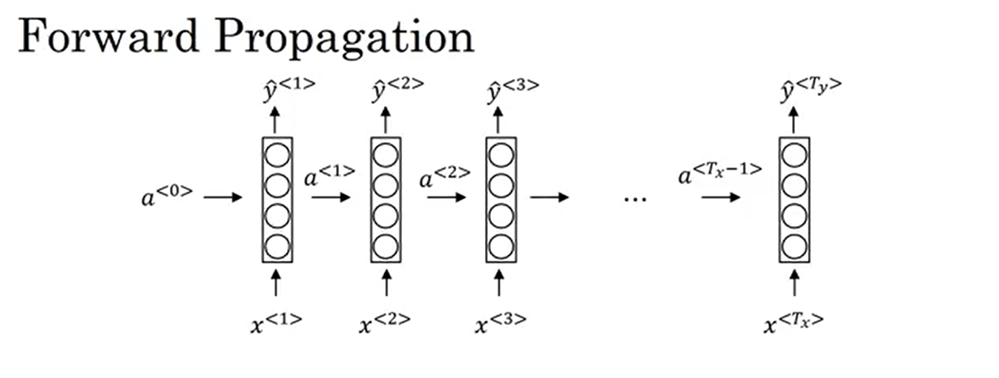

## Why Sequence Models Matter in Deep Learning

Sequence models are among the most powerful and exciting tools in modern deep learning. They’ve transformed fields like speech recognition, natural language processing, machine translation, music generation, and even bioinformatics. And in this blog post, you’ll get an intuition for why they matter, where they’re used, and how to implement a type of a sequence model (RNNs)

### Speech Recognition: Sequences In, Sequences Out

Imagine you're building a system that takes an audio clip and outputs a text transcript.
The input (audio) is a sequence over time. The output (words) is also a sequence.

Because both the input and output unfold over time, we need models that understand the temporal structure of data; not just individual inputs, but how they relate to one another over time. This is exactly where sequence models like Recurrent Neural Networks (RNNs) shine.

### Music Generation: Sequences Out

In some problems, only the output is a sequence.

Suppose you want to generate music. The input might be:

* Nothing at all
* A genre label
* Or just a few starting notes

But the output is a full piece of music which is a sequence.
Here, a model like an RNN is still useful, because it generates each note based on the ones before it.

### Sentiment Classification: Sequences In

Sometimes, only the input is a sequence.

Given a sentence like:

> “There is nothing to like in this movie.”

You want to predict a single label, such as a star rating.
Even though the output is just one number, the input is a sequence of words. The model must understand how those words interact to capture the tone or sentiment.

### DNA Sequence Analysis

In biology, DNA is composed of sequences of letters: A, C, G, T.

Sequence models help us answer questions like:

* Does this region of DNA code for a protein?
* Where are the mutations?

Here again, you’re processing and learning from sequences.

### Machine Translation: Sequences In, Sequences Out (Different Lengths)

Take the French sentence:

> *“Voulez-vous chanter avec moi?”*

We want the model to output:

> “Do you want to sing with me?”

This is a sequence-to-sequence task, where both input and output are sequences, and importantly, they may be of different lengths.

### Video Activity Recognition

Here, the input is a sequence of video frames, and the goal is to predict what activity is happening (e.g., running, jumping, dancing).

Every frame adds new information. Sequence models help process the visual data over time.

### Named Entity Recognition (NER)

In NER, you're given a sentence and asked to label which words refer to people, organizations, or places.

For example:

> “Tony Stark founded Stark Industries.”

The model must output:

* “Tony Stark” → PERSON
* “Stark Industries” → ORGANIZATION

In this case, both input and output are sequences, and they have the same length.

### One Framework, Many Shapes

As you've seen, sequence models are incredibly versatile. Depending on the task:

* The input may be a sequence
* The output may be a sequence
* Or both may be sequences, possibly of different lengths

Despite this variety, sequence models like RNNs provide a common foundation for solving them all.

---

## Recurrent Neural Networks (RNNs): Understanding the Basics

When working with sequential data like text, speech, DNA, or time-series, we need models that can understand order and context. 

Therefore, we’ll explore what RNNs are, why we need them, and how they work, both conceptually and mathematically.

### Why Not Use a Standard Neural Network?

Suppose you want to identify names in a sentence like:

> “My name is Harry and I live in London.”

Each word is an input, and for each word, the model should predict whether it’s part of a name (yes or no). A simple approach might be to feed all the words into a fully connected neural network, maybe as one-hot vectors, and get binary outputs.

But this idea runs into two major problems:

1. Variable-length sequences
   Not all sentences are the same length. You’d have to pad inputs to the maximum sentence length, which is inefficient and doesn't capture the real structure of language.

2. No parameter sharing
   If “Harry” is recognized as a name in one position, a standard network doesn’t generalize that knowledge when “Harry” appears in another position. Every position is treated as unique, meaning we lose the chance to reuse learned features across time.

These problems call for a better design one that’s flexible in input/output length and shares parameters across time. That’s exactly what RNNs offer.

---

### What is a Recurrent Neural Network?

An RNN is a type of neural network designed to process sequences, one element at a time, while maintaining a memory of past elements through its internal state.

Here’s how it works:

1. You start with the first word (say, `x₁`), and feed it into the RNN.
2. The RNN processes it and outputs a hidden state `a₁`.
3. This hidden state is passed to the next time step, along with the next input word `x₂`.
4. This process continues until the end of the sequence.

At each step, the network uses:

* The current input `xₜ`
* The previous hidden state `aₜ₋₁`

to produce:

* A new hidden state `aₜ`
* A prediction `ŷₜ` (optional, depending on the task)

---

### Visualizing the RNN Structure



### What Actually Happens Inside?

Let's define the forward pass at time step `t`.

1. Hidden state computation:

   $$
   a^{(t)} = g(W_{aa} a^{(t-1)} + W_{ax} x^{(t)} + b_a)
   $$

* $g$ is typically a non-linear activation function like $\tanh$
* $W_{aa}$ and $W_{ax}$ are weight matrices
* $b_a$ is a bias vector


2. Output prediction:

   $$
   \hat{y}^{(t)} = g_{\text{out}}(W_{ya} a^{(t)} + b_y)
   $$

The output activation $g_{\text{out}}$ might be $\text{sigmoid}$ (for binary tasks) or $\text{softmax}$ (for multi-class tasks).
You start with $a^{(0)} = 0$ (a zero vector) and move forward through time using the equations above.


---

### Simplifying the Equations

To reduce notation clutter, we can **concatenate** the input and previous hidden state into one vector:

$$
a^{(t)} = g(W_a [a^{(t-1)}, x^{(t)}] + b_a)
$$

Where:

* $[a^{(t-1)}, x^{(t)}]$ means stacking the two vectors together
* $W_a$ is a merged matrix combining $W_{aa}$ and $W_{ax}$


This saves us from handling two weight matrices separately and simplifies future architectures like GRUs and LSTMs.

---

### Parameter Sharing Over Time

A powerful aspect of RNNs is weight sharing:

* The same weights $W_{aa}$, $W_{ax}$, and $W_{ya}$ are used at every time step.

* This helps generalize learning across time positions and significantly reduces the number of parameters

---

### A Limitation: Unidirectional Context

One downside of this setup is that it only uses past inputs to make predictions.

For example, in the sentence:

> “He said Teddy Roosevelt was a great president.”

If we want to predict whether “Teddy” is a name, we’d benefit from seeing the word “Roosevelt”, which comes after. But a standard RNN can’t look into the future only the past.

We’ll fix this later with Bidirectional RNNs (BRNNs), which use both past and future context.

---

## Understanding Backpropagation Through Time in RNNs

In the previous section, we explored how a Recurrent Neural Network (RNN) processes sequences using forward propagation. Now, it’s time to dive into how learning actually happens in an RNN; through a process called Backpropagation Through Time (BPTT).

Even though most deep learning frameworks handle this under the hood, understanding the concept gives you valuable insight into how RNNs learn from sequential data.


### Quick Recap: Forward Propagation in RNNs

An RNN takes a sequence of inputs; say, words in a sentence: $x_1, x_2, x_3, \ldots, x_{T_x}$. At each time step $t$, it computes a hidden state $a^{(t)}$ based on:

* The input at that time $x^{(t)}$
* The previous hidden state $a^{(t-1)}$

Using the shared parameters $W_a$ and $b_a$, each hidden state is calculated and passed forward.

Then, using the hidden state, the RNN makes a prediction $\hat{y}^{(t)}$ at each time step using another set of shared parameters $W_y$ and $b_y$.

This way, the RNN processes input left to right, one time step at a time; building up activations and predictions.

---

### Enter Backpropagation Through Time (BPTT)

Once the forward pass is complete, we calculate the loss; that is, how far off our predictions $\hat{y}^{(t)}$ are from the actual labels $y^{(t)}$.

We use a per-time-step loss function, often binary cross-entropy or categorical cross-entropy, depending on the task:

$$
\mathcal{L}^{(t)} = -[y^{(t)} \log(\hat{y}^{(t)}) + (1 - y^{(t)}) \log(1 - \hat{y}^{(t)})]
$$

To get the total loss for the entire sequence, we sum over all time steps:

$$
\mathcal{L} = \sum_{t=1}^{T} \mathcal{L}^{(t)}
$$

---

### So What is Backpropagation Through Time?

Just like in feedforward networks, we now want to adjust the weights to minimize this loss. But since the RNN reuses weights across all time steps, we have to compute gradients across time as well.

That’s where Backpropagation Through Time (BPTT) comes in. Here’s how it works:

* Starting from the last time step $T$, we compute the gradients of the loss with respect to the output, then backpropagate those gradients through each time step all the way to the beginning.
* This backward flow traverses the hidden states and shared weights; effectively “going back in time.”
* The updates for weights like $W_a$, $W_y$, $b_a$, and $b_y$ accumulate gradients from **all time steps** because they are reused at every step.

This recursive nature, the dependence of each state on the previous one, is why the backward pass must go through the entire unrolled computation graph of the RNN.

---

### Why is BPTT Special?

What makes BPTT unique is the time dimension. In traditional neural networks, gradients flow through layers. In RNNs, they flow through time steps, which can be thought of as layers unrolled over time.

This is also where RNNs can struggle. Because of this long chain of gradients, values can:

* Vanish (shrink toward zero); making it hard to learn long-term dependencies
* Explode (grow uncontrollably); destabilizing training

---

###  Why Is It Called Backpropagation Through Time?

It’s simple: during training, we go forward through time in the forward pass, and backward through time in the backward pass; hence the name.

You don’t need a time machine, just a good optimizer.

This beautifully named technique makes RNNs capable of learning from sequences, whether it’s understanding speech, predicting words, or tagging names.

---

## More on RNN Architectures

Recurrent Neural Networks (RNNs) are incredibly powerful tools for working with sequences. But one size doesn’t fit all! Depending on the task, the structure of your input and output may vary and luckily, RNNs are flexible enough to handle that.


---

### One-to-One: The Classic Feedforward Network

Let’s start with the simplest case.

This is your typical vanilla neural network. You have a single input $x$ and a single output $y$. It doesn’t involve sequences, so we usually don’t even call this an RNN.

#### Example:

* Image classification: Input is an image, output is the label.
* Not really an RNN; just included here for completeness.

---

### One-to-Many: Sequence Generation

In this setting, we have one input and multiple outputs; meaning the model generates a sequence from a single input.

#### Example:

* Music generation: You might feed in the genre (e.g., jazz) or first note, and the RNN generates a sequence of notes.
* Text generation: Given a topic word like "space", generate a full paragraph.

#### Architecture:

* Input: $x$ (a single value or vector)
* Outputs: $\hat{y}^{(1)}, \hat{y}^{(2)}, \ldots, \hat{y}^{(T_y)}$

Often, the first predicted output is fed into the model to help predict the next one; this creates a feedback loop useful for generation.

---

### Many-to-One: Sequence Classification

Here, the RNN reads a sequence of inputs and produces a single output.

#### Example:

* Sentiment classification: Given a review like "There is nothing to like in this movie", predict a score from 1 to 5.
* Spam detection: Analyze an email's content and classify it as spam or not.

#### Architecture:

* Inputs: $x^{(1)}, x^{(2)}, \ldots, x^{(T_x)}$
* Output: A single $\hat{y}$ at the end

The RNN reads the whole input before making a prediction, usually after the last word or element in the sequence.

---

### Many-to-Many (Same Length): Sequence Labeling

This is the type of RNN you've likely seen the most.

Both the input and the output are sequences, and their lengths are equal.

#### Example:

* Named Entity Recognition (NER): Tag each word in a sentence as a person's name, location, etc.
* Part-of-speech tagging: Label each word as noun, verb, adjective, etc.

#### Architecture:

* Inputs: $x^{(1)}, x^{(2)}, \ldots, x^{(T)}$
* Outputs: $\hat{y}^{(1)}, \hat{y}^{(2)}, \ldots, \hat{y}^{(T)}$

The model outputs a prediction at every time step. Perfect for tasks where each input element needs a corresponding label.

---

### Many-to-Many (Different Length): Encoder–Decoder Architecture

Now here’s a twist: What if the input and output sequences have different lengths? That’s where the encoder–decoder architecture comes in.

#### Example:

* Machine translation: Translate “Je t’aime” to “I love you.” The input (French) and output (English) can have different numbers of words.
* Image captioning: Convert an image (single input) into a variable-length description.

#### Architecture:

1. Encoder: Reads the full input sequence and compresses it into a context vector.
2. Decoder: Uses the context to generate the output sequence.

This setup is foundational for many advanced models, including those used in transformers and attention-based networks.

---

## CODE AND EXPLANATION

We wiil be focusing on a many to one example; where we train an RNN model to classify names

You can explore the notebook here:

- 📘 <a href="https://github.com/Tony-Ale/Notebooks/blob/main/RNN.ipynb" target="_blank">View on GitHub</a>  
- 🚀 <a href="https://colab.research.google.com/github/Tony-Ale/Notebooks/blob/main/RNN.ipynb" target="_blank">Open in Colab</a>

- 📘 <a href="https://download.pytorch.org/tutorial/data.zip" target="_blank">Download data</a>
---

### Extract the dataset

```python
import zipfile

# Path to your zip file
zip_path = "data.zip"

# Extract all contents
with zipfile.ZipFile(zip_path, 'r') as zip_ref:
    zip_ref.extractall("data")  # Extract to 'data' folder
```

---
### Get a list of allowed chars, and a function to clean up data


```python
import string
import unicodedata

# I will use "_" to represent an out-of-vocabulary character, that is, any character we are not handling in our model
allowed_chars = string.ascii_letters  + " .,;'" + "_"
n_letters = len(allowed_chars)

def unicodeToAscii(s):
    return ''.join(
        c for c in unicodedata.normalize('NFD', s)
        if unicodedata.category(c) != 'Mn'
        and c in allowed_chars
    )


```


```python
print (f"converting 'Ślusàrski' to {unicodeToAscii('Ślusàrski')}")
```

    converting 'Ślusàrski' to Slusarski


---
### Helper to convert names to tensors


```python
import torch
def letter_to_index(letter:str):
  if letter not in allowed_chars:
    return allowed_chars.find("_")
  else:
    return allowed_chars.find(letter)

def name_to_tensor(name:str):
  tensor = torch.zeros(len(name), 1, n_letters)

  for idx, letter in enumerate(name):
    tensor[idx][0][letter_to_index(letter)] = 1
  return tensor
```


```python
print(name_to_tensor("Albert"))
```

    tensor([[[0., 0., 0., 0., 0., 0., 0., 0., 0., 0., 0., 0., 0., 0., 0., 0., 0.,
              0., 0., 0., 0., 0., 0., 0., 0., 0., 1., 0., 0., 0., 0., 0., 0., 0.,
              0., 0., 0., 0., 0., 0., 0., 0., 0., 0., 0., 0., 0., 0., 0., 0., 0.,
              0., 0., 0., 0., 0., 0., 0.]],
    
            [[0., 0., 0., 0., 0., 0., 0., 0., 0., 0., 0., 1., 0., 0., 0., 0., 0.,
              0., 0., 0., 0., 0., 0., 0., 0., 0., 0., 0., 0., 0., 0., 0., 0., 0.,
              0., 0., 0., 0., 0., 0., 0., 0., 0., 0., 0., 0., 0., 0., 0., 0., 0.,
              0., 0., 0., 0., 0., 0., 0.]],
    
            [[0., 1., 0., 0., 0., 0., 0., 0., 0., 0., 0., 0., 0., 0., 0., 0., 0.,
              0., 0., 0., 0., 0., 0., 0., 0., 0., 0., 0., 0., 0., 0., 0., 0., 0.,
              0., 0., 0., 0., 0., 0., 0., 0., 0., 0., 0., 0., 0., 0., 0., 0., 0.,
              0., 0., 0., 0., 0., 0., 0.]],
    
            [[0., 0., 0., 0., 1., 0., 0., 0., 0., 0., 0., 0., 0., 0., 0., 0., 0.,
              0., 0., 0., 0., 0., 0., 0., 0., 0., 0., 0., 0., 0., 0., 0., 0., 0.,
              0., 0., 0., 0., 0., 0., 0., 0., 0., 0., 0., 0., 0., 0., 0., 0., 0.,
              0., 0., 0., 0., 0., 0., 0.]],
    
            [[0., 0., 0., 0., 0., 0., 0., 0., 0., 0., 0., 0., 0., 0., 0., 0., 0.,
              1., 0., 0., 0., 0., 0., 0., 0., 0., 0., 0., 0., 0., 0., 0., 0., 0.,
              0., 0., 0., 0., 0., 0., 0., 0., 0., 0., 0., 0., 0., 0., 0., 0., 0.,
              0., 0., 0., 0., 0., 0., 0.]],
    
            [[0., 0., 0., 0., 0., 0., 0., 0., 0., 0., 0., 0., 0., 0., 0., 0., 0.,
              0., 0., 1., 0., 0., 0., 0., 0., 0., 0., 0., 0., 0., 0., 0., 0., 0.,
              0., 0., 0., 0., 0., 0., 0., 0., 0., 0., 0., 0., 0., 0., 0., 0., 0.,
              0., 0., 0., 0., 0., 0., 0.]]])


---
### Create a custom dataset handler 


```python
from torch.utils.data import Dataset
import os
import glob

# Creating a custom Dataset class for loading names from text files
class NamesDataset(Dataset):
  def __init__(self, path):
    self.path = path # Path to the folder containing .txt files
    labels_set = set() # Used to collect all unique labels
    self.data = [] # This will store all the names
    self.data_tensors = [] # This will store the tensor versions of the names
    self.labels = [] # This will store the label (e.g., "English") for each name
    self.label_tensors = [] # This will store the tensor versions of the labels

    # Find all .txt files in the given path
    text_files = glob.glob(os.path.join(path, '*.txt'))

    for filename in text_files:
      basename = os.path.basename(filename) # e.g., "English.txt"
      label = os.path.splitext(basename)[0] # e.g., "English"
      labels_set.add(label) # Add label to the set of all unique labels
      with open(filename, encoding='utf-8') as file:
        names = file.read().strip().split("\n") # Split file by new lines
        for name in names:
          self.data.append(name)
          self.labels.append(label)

          self.data_tensors.append(name_to_tensor(name))

    # Create a list of all unique labels (e.g., ['English', 'French', ...])
    self.label_uniq = list(labels_set)

    # Convert each label to a tensor (as an index from label_uniq)
    for label in self.labels:
      self.label_tensors.append(torch.tensor([self.label_uniq.index(label)], dtype=torch.long))

  # Return total number of data samples (i.e., number of names)
  def __len__(self):
    return len(self.data)

  # Return a specific item: (name_tensor, label_tensor, name_as_string)
  def __getitem__(self, idx):
    data_item = self.data[idx]
    return self.data_tensors[idx], self.label_tensors[idx], data_item
```

---

### Load and process data

```python
all_data = NamesDataset("data/data/names")
```

---

### split data


```python
# we cant use a dataloader to batch the data because each name has different lengths
train_dataset, test_dataset = torch.utils.data.random_split(all_data, [0.8, 0.2])
```

---
### Observe name tensor data structure

```python
print(f"Name: {train_dataset[0][-1]}, Tensor Shape: {train_dataset[0][0].shape}")
```

    Name: Toal, Tensor Shape: torch.Size([4, 1, 58])


---

### Set up a simple RNN cell 

```python
# Creating the network
import torch.nn as nn
class RNNcell(nn.Module):
  def __init__(self, input_size, hidden_size):
    super().__init__()

    # This layer will handle the input at the current time step (x_t)
    self.x_t = nn.Linear(input_size, hidden_size)

    # This layer will handle the hidden state from the previous time step (h_t)
    self.h_t = nn.Linear(hidden_size, hidden_size)

  def forward(self, x, h_x):
    # x is of shape (batch_size, n_rows, n_cols)
    return torch.tanh(self.x_t(x) + self.h_t(h_x))


```
---
### Custom RNN Implementation


```python
class RNN(nn.Module):
  def __init__(self, input_size, hidden_size, RNNcell=RNNcell):
    super().__init__()
    self.input_size = input_size
    self.hidden_size = hidden_size
    self.RNNcell = RNNcell(input_size, hidden_size)

  def forward(self, x):

    output = []
    # x is of shape (batch_size, n_rows, n_cols)
    n_steps = x.shape[0] # this is the number of data points

    # Initialize the hidden state as a tensor of zeros; hidden state for each data point
    h_x = torch.zeros(x.shape[1], self.hidden_size) # hidden state

    for i in range(n_steps):
      # At each step, feed the character and previous hidden state into the RNN cell
      # x[i] has shape (1, 58)

      h_x = self.RNNcell(x[i], h_x)
      output.append(h_x)

    return torch.stack(output), h_x
```
---
### Set up character RNN to train

```python
class charRNN(nn.Module):
  def __init__(self, input_size=n_letters, hidden_size=128, output_size=len(all_data.label_uniq) ):
    super().__init__()
    self.rnn = RNN(input_size, hidden_size)
    self.h2o = nn.Linear(hidden_size, output_size) # hidden to output

  def forward(self, x):
    rnn_output, hidden = self.rnn(x)
    output = self.h2o(hidden)
    return output
```

---
### Initialize model 

```python
model = charRNN()
device = torch.device("cuda" if torch.cuda.is_available() else "cpu")
model.to(device)
```


    charRNN(
      (rnn): RNN(
        (RNNcell): RNNcell(
          (x_t): Linear(in_features=58, out_features=128, bias=True)
          (h_t): Linear(in_features=128, out_features=128, bias=True)
        )
      )
      (h2o): Linear(in_features=128, out_features=18, bias=True)
    )


---
### Set up loss function


```python
criterion = nn.CrossEntropyLoss()
optimizer = torch.optim.Adam(model.parameters(), lr=0.001)
```

---
### Train model


```python
import random
import numpy as np
# Train the model
epochs = 27
batch_size = 64
model.train()
for epoch in range(epochs):
  running_loss = 0.0
  batches = list(range(len(train_dataset)))
  random.shuffle(batches)
  batches = np.array_split(batches, len(train_dataset)//batch_size)
  for batch in batches:
    batch_loss = 0.0
    for i in batch:
      data, target, _ = train_dataset[i]
      data, target = data.to(device), target.to(device)
      output = model(data)
      loss = criterion(output, target)
      batch_loss += loss
    batch_loss.backward()
    optimizer.step()
    optimizer.zero_grad()
    running_loss += batch_loss.item()
  print(f"Epoch {epoch+1}, Loss: {running_loss/len(train_dataset)}")


```

    Epoch 1, Loss: 1.5168744960134086
    Epoch 2, Loss: 1.07276706766815
    Epoch 3, Loss: 0.9443094840233828
    Epoch 4, Loss: 0.868816487726803
    Epoch 5, Loss: 0.8022869074478245
    Epoch 6, Loss: 0.7566109913817676
    Epoch 7, Loss: 0.7251738077973666
    Epoch 8, Loss: 0.6961696346848275
    Epoch 9, Loss: 0.668678914565375
    Epoch 10, Loss: 0.6420803967923631
    Epoch 11, Loss: 0.6185171896909569
    Epoch 12, Loss: 0.5968777989094165
    Epoch 13, Loss: 0.5741230902903404
    Epoch 14, Loss: 0.5545712854615777
    Epoch 15, Loss: 0.5383377420798334
    Epoch 16, Loss: 0.5194439397505479
    Epoch 17, Loss: 0.4994999759075502
    Epoch 18, Loss: 0.48689501603246477
    Epoch 19, Loss: 0.4668450525362198
    Epoch 20, Loss: 0.45308816020248244
    Epoch 21, Loss: 0.4383830129877568
    Epoch 22, Loss: 0.4217781994440784
    Epoch 23, Loss: 0.4076407665333445
    Epoch 24, Loss: 0.39048308168223606
    Epoch 25, Loss: 0.3748656043079989
    Epoch 26, Loss: 0.36341478405972644
    Epoch 27, Loss: 0.3547410526133118


---
### Helper function to get top-k prediction


```python
def get_topk_label(output, output_labels):
  values, indices = output.topk(1)
  label_idx = indices[0].item()
  return output_labels[label_idx], label_idx
```

---
### Determine model accuracy

```python
# Determine accuracy
model.eval()
with torch.no_grad():
  correct = 0
  total = len(test_dataset)
  for data, target, _ in test_dataset:
    data, target = data.to(device), target.to(device)
    output = model(data)
    label, label_idx = get_topk_label(output, all_data.label_uniq)
    if label_idx == target.item():
      correct += 1
  print(f"Accuracy: {100*correct/total}")
```

    Accuracy: 81.58943697060289


---
### Test the model

```python
# test the model
import random
model.eval()
with torch.no_grad():
  indices = random.sample(range(len(test_dataset)), 10)
  test_sample = [test_dataset[i] for i in indices]
  for (data, target, name), idx in zip(test_sample, indices):
    data, target = data.to(device), target.to(device)
    output = model(data)
    label, label_idx = get_topk_label(output, all_data.label_uniq)
    print(f"Name: {name}, Predicted: {label}, Actual: {all_data.label_uniq[target.item()]}")


```

    Name: Alman, Predicted: English, Actual: Russian
    Name: Pointer, Predicted: English, Actual: English
    Name: Junin, Predicted: Russian, Actual: Russian
    Name: Maryanov, Predicted: Russian, Actual: Russian
    Name: Tsegoev, Predicted: Russian, Actual: Russian
    Name: Judin, Predicted: Russian, Actual: Russian
    Name: Kennard, Predicted: English, Actual: English
    Name: Ventura, Predicted: Spanish, Actual: English
    Name: Abadi, Predicted: Arabic, Actual: Arabic
    Name: Schlusser, Predicted: German, Actual: German

