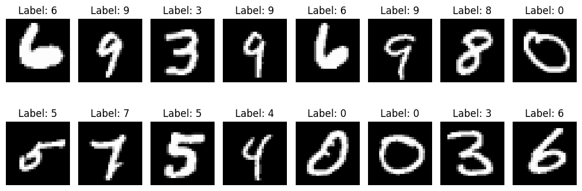
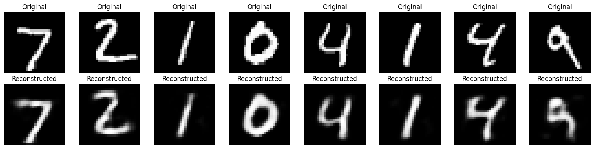
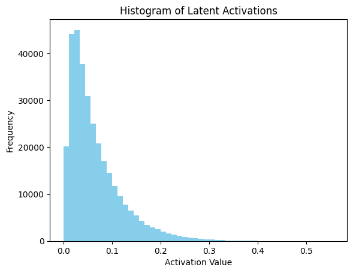
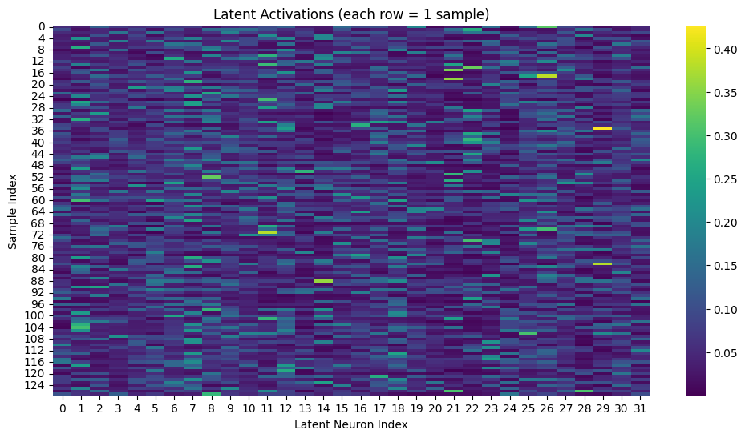

## Sparse Autoencoders

### What Is a Sparse Autoencoder?

A sparse autoencoder is a variation of the basic autoencoder where we encourage the hidden (latent) layer to be sparse meaning:

> Most neurons should be inactive (close to 0) for any given input.

This forces the model to learn a compressed, disentangled representation, where only a few features activate for each input; similar to how the human brain processes information.

---

### Why Enforce Sparsity?

While a regular autoencoder learns compressed features, it doesn’t limit how many features are activated. Sparse autoencoders add a constraint that:

* Prevents over-reliance on all features.
* Encourages specialization; each neuron learns to respond to specific patterns.
* Produces interpretable activations, useful in feature extraction and anomaly detection.

---

### How Do We Make It Sparse?

We don’t modify the architecture. Instead, we add a sparsity penalty to the loss function that penalizes neurons that are too active.

#### Steps:

1. Compute the average activation of each neuron in the latent layer over a batch.

2. Encourage this average to stay close to a small value (e.g., `ρ = 0.05`).

3. Use KL divergence as a penalty:

   $$
   KL(ρ \parallel \hat{ρ_j}) = ρ \log \frac{ρ}{\hat{ρ_j}} + (1 - ρ) \log \frac{1 - ρ}{1 - \hat{ρ_j}} 
   $$

   where:

   * ρ = desired sparsity (e.g. 0.05)
   * $\hat{ρ_j}$ = actual average activation of neuron j

4. Add this KL divergence term to the reconstruction loss.

---

### Total Loss Function

```text
Total Loss = BCE Loss (reconstruction) + β × Sparsity Penalty
```

Where:

* β controls how strongly we penalize over-activation (e.g. 1e-3 or 1e-4).
* Sparsity Penalty is the sum of KL divergence across all latent neurons.

---

### Understanding the Sparsity Constraint

Recall that in neural networks, we pass data through activation functions like `sigmoid`, `tanh`, `ReLU`, or `Leaky ReLU`. These functions determine whether a neuron “fires” (activates).

For example:

* A neuron is activated when its output is close to 1
* It's inactive when the output is close to 0

Now, imagine we have $s_l$ neurons in some hidden layer $l$, and we label the activation of the $j$-th neuron as $a_j^{(l)}(\cdot)$.

We want each neuron to be active only occasionally; for example, only for 5% of inputs.
This desired level of activation is called the sparsity parameter, denoted as:

$$
\rho = 0.05
$$


#### Average Activation

Let’s say we pass $n$ training examples through the autoencoder. We can compute the average activation of each hidden neuron across all inputs:

<div>
$$ 
\hat{\rho}_j^{(l)} = \frac{1}{n} \sum_{i=1}^n [a_j^{(l)}(\mathbf{x}^{(i)})] \approx \rho 
$$
</div>

We want this average activation $\hat{\rho}_j$ to be **close to** our desired sparsity $\rho$.

---

### Enforcing Sparsity with KL Divergence

To force the model to obey this sparsity constraint, we add a penalty term to the loss function. This term is based on the **Kullback-Leibler (KL) divergence**, which measures the difference between two probability distributions.

Specifically, we compare:

* $\rho$ (what we want)
* $\hat{\rho}_j$ (what the model is actually doing)

The KL divergence between them is:

$$
D_\text{KL}(\rho \| \hat{\rho}_j) = \rho \log \frac{\rho}{\hat{\rho}_j} + (1 - \rho) \log \frac{1 - \rho}{1 - \hat{\rho}_j}
$$

This value is **0 when $\hat{\rho}_j = \rho$** and increases as the actual activation diverges from the target.

---

### Total Sparse Autoencoder Loss

We now add this penalty term to the normal reconstruction loss. The total loss becomes:

<div>
$$
\begin{aligned}
L_\text{SAE}(\theta) 
&= L(\theta) + \beta \sum_{l=1}^L \sum_{j=1}^{s_l} D_\text{KL}(\rho \| \hat{\rho}_j^{(l)}) \\
&= L(\theta) + \beta \sum_{l=1}^L \sum_{j=1}^{s_l} \left[ \rho \log \frac{\rho}{\hat{\rho}_j} + (1 - \rho) \log \frac{1 - \rho}{1 - \hat{\rho}_j} \right]
\end{aligned}
$$
</div>

* $L(\theta)$: your reconstruction loss (e.g., Binary Cross Entropy)
* $\beta$: hyperparameter controlling how much weight to give to the sparsity penalty
* $s_l$: number of neurons in layer $l$

---

### 💡 Intuition

* **Low $\hat{\rho}_j$**: The neuron is mostly inactive — good.
* **High $\hat{\rho}_j$**: The neuron is too active — we penalize this.

This technique makes sure only a few neurons activate per input, encouraging compact and interpretable features.

---

### Full Sparse Autoencoder Loss: What’s Going On?

Here’s the formula again:

$$
L_{\text{SAE}}(\theta) = L(\theta) + \beta \sum_{l=1}^{L} \sum_{j=1}^{s_l} D_{\text{KL}}(\rho \parallel \hat{\rho}_j^{(l)})
$$

Or in expanded form:

$$
L_{\text{SAE}}(\theta) = L(\theta) + \beta \sum_{l=1}^{L} \sum_{j=1}^{s_l} \left[
\rho \log \frac{\rho}{\hat{\rho}_j} + (1 - \rho) \log \frac{1 - \rho}{1 - \hat{\rho}_j}
\right]
$$


#### What Each Term Means:

* **$L(\theta)$**: This is the regular **reconstruction loss** (e.g., Binary Cross Entropy), measuring how well the autoencoder reconstructs the input.
* **$\beta$**: A hyperparameter that controls **how strongly we enforce sparsity**.
* **$L$**: The number of hidden layers where we want to apply the sparsity constraint.
* **$s_l$**: The number of neurons in the $l$-th hidden layer.
* **$\hat{\rho}_j^{(l)}$**: The **average activation** of the $j$-th neuron in layer $l$, computed over the entire batch.
* **$\rho$**: The **target sparsity** (e.g., 0.05), meaning we want neurons to be active only 5% of the time.

#### The Double Summation:

$$
\sum_{l=1}^{L} \sum_{j=1}^{s_l} D_{\text{KL}}(\rho \parallel \hat{\rho}_j^{(l)})
$$

This says:

> “For **every hidden layer** $l$, and for **every neuron** $j$ in that layer, compute how far the average activation $\hat{\rho}_j$ is from the target $\rho$, using KL divergence.”

So:

* Outer sum = go through all relevant hidden layers
* Inner sum = go through every neuron in each layer
* Total result = total sparsity penalty for all neurons across all layers


#### KL Divergence Term:

$$
D_{\text{KL}}(\rho \parallel \hat{\rho}_j) = \rho \log \frac{\rho}{\hat{\rho}_j} + (1 - \rho) \log \frac{1 - \rho}{1 - \hat{\rho}_j}
$$

This measures how far $\hat{\rho}_j$ is from our desired value $\rho$:

* If $\hat{\rho}_j \approx \rho$, this term is close to **0** (no penalty).
* If $\hat{\rho}_j \gg \rho$, this term becomes **large** (neuron too active → high penalty).


#### Final Meaning of the Full Formula:

The total loss is the usual reconstruction loss **plus a penalty** that increases whenever a neuron’s **average activation is too high**, across any hidden layer you’re monitoring.

The goal is to encourage most neurons to be silent (near 0) most of the time, and only activate when really necessary.

---

### Why Only the Latent Representation Is Made Sparse

In a sparse autoencoder, we apply the sparsity constraint specifically to the latent representation, also known as the bottleneck layer. This is intentional, and it serves a clear purpose.

The latent layer is the most compressed part of the network, it's where the model is forced to distill the input down into its most essential features. By enforcing sparsity here, we encourage the network to represent each input using just a few active neurons, which leads to more efficient, disentangled, and interpretable representations.

We typically avoid applying sparsity to earlier layers because those layers are still in the process of extracting low-level features from the input. Imposing sparsity too early could restrict the network’s ability to learn rich representations. Instead, we allow earlier layers to be expressive, and only constrain the latent layer where compactness and selectivity really matter.

This approach also aligns with how biological systems process information. In the brain, many neurons may receive and process sensory input, but only a small subset of neurons in higher-order areas fire to encode specific patterns or concepts.

From a practical perspective, applying sparsity only to the latent layer is also simpler and more efficient. It reduces the computational cost of calculating the KL divergence, and makes the training more stable and interpretable.

In short, we focus the sparsity on the latent layer because that’s where we want the network to learn a clean, efficient, and minimal representation of the input.

---

## CODE AND EXPLANATION

You can explore the notebook here:

- 📘 <a href="https://github.com/Tony-Ale/Notebooks/blob/main/Sparse_Autoencoder.ipynb" target="_blank">View on GitHub</a>  
- 🚀 <a href="https://colab.research.google.com/github/Tony-Ale/Notebooks/blob/main/Sparse_Autoencoder.ipynb" target="_blank">Open in Colab</a>
---

### First of all load the dataset 

```python
# =======================
# Load the MNIST handwritten digit dataset and return DataLoaders for training and testing.
# Each image is converted to a PyTorch tensor and normalized to the [0, 1] range.
# DataLoaders enable efficient batching, shuffling, and iteration during training.
# =======================
from torchvision import datasets, transforms # Import MNIST dataset and image transforms
from torch.utils.data import DataLoader # For batching and loading the dataset

def get_mnist_loaders(batch_size=128):

  # Convert images to PyTorch tensors with values scaled to [0, 1]
  transform = transforms.ToTensor()

  # Download and load the training dataset
  train_dataset = datasets.MNIST(root='./data', train=True, download=True, transform=transform)

  # Download and load the test dataset
  test_dataset = datasets.MNIST(root='./data', train=False, download=True, transform=transform)

  # Wrap datasets in DataLoaders to enable batching and shuffling
  train_loader = DataLoader(train_dataset, batch_size=batch_size, shuffle=True)
  test_loader = DataLoader(test_dataset, batch_size=batch_size, shuffle=False)

  return train_loader, test_loader

```
---
### Write helper code to visualize data set

```python
# =======================
# Visualize a batch of MNIST digit images from the training dataset.
# This function loads a mini-batch using get_mnist_loaders() and displays the digits with their labels.
# Useful for quickly inspecting the raw input data before training.
# =======================
import matplotlib.pyplot as plt # For plotting and displaying images
def visualize_batch(batch_size=16):
  # Load a mini-batch of training data
  train_loader, _ = get_mnist_loaders(batch_size)
  images, labels = next(iter(train_loader)) # Get the first batch

  # Create a horizontal grid of images
  plt.figure(figsize=(10, 4))
  for i in range(batch_size):
    plt.subplot(2, batch_size // 2, i + 1) # 2 rows, batch_size/2 columns
    plt.imshow(images[i][0], cmap='gray') # Show the image (channel 0 since MNIST is grayscale)
    plt.title(f"Label: {labels[i].item()}")
    plt.axis('off')
  plt.tight_layout()
  plt.show()
```

```python
visualize_batch()
```

    100%|██████████| 9.91M/9.91M [00:00<00:00, 56.3MB/s]
    100%|██████████| 28.9k/28.9k [00:00<00:00, 1.62MB/s]
    100%|██████████| 1.65M/1.65M [00:00<00:00, 14.1MB/s]
    100%|██████████| 4.54k/4.54k [00:00<00:00, 3.21MB/s]


    

    
---

### KL Divergence sparsity penalty

<div>
$$
\begin{aligned}
D_\text{KL}\left(\rho \,\|\, \hat{\rho}_j^{(l)}\right)
= \rho \log \frac{\rho}{\hat{\rho}_j^{(l)}}
+ (1 - \rho) \log \frac{1 - \rho}{1 - \hat{\rho}_j^{(l)}}
\end{aligned}
$$
</div>


```python
# KL Divergence sparsity penalty
def kl_divergence(rho, rho_hat):
  rho_hat = torch.clamp(rho_hat, 1e-6, 1 - 1e-6) # prevent log(0)
  return (rho * torch.log(rho / rho_hat) + (1 - rho) * torch.log((1 - rho) / (1 - rho_hat))).sum()
```

The KL divergence involves logarithmic operations and logarithms are undefined at 0. that is why rho_hat is clamped in order to prevent numerical instability during training.

---

### Set up the model architecture

```python
# =======================
# Define a fully-connected Autoencoder for compressing and reconstructing MNIST digit images.
# Architecture:
#   Encoder: 784 → 128 → 32
#   Decoder: 32 → 128 → 784
# The model learns to compress 28x28 images into a 32-dimensional latent space and reconstruct them.
# =======================
import torch
import torch.nn as nn
class Autoencoder(nn.Module):
  def __init__(self, input_dim=784, hidden_dim=128, latent_dim=32):
    super().__init__()

    # Encoder: compress input image to a 32-dimensional latent vector
    self.encoder = nn.Sequential(
        nn.Linear(input_dim, hidden_dim), # Flattened image → hidden layer
        nn.ReLU(),
        nn.Linear(hidden_dim, latent_dim), # Hidden → latent representation
        nn.Sigmoid() # To ensure the latent vector is between 0 and 1
    )

    # Decoder: reconstruct image from the latent vector
    self.decoder = nn.Sequential(
        nn.Linear(latent_dim, hidden_dim), # Latent → hidden layer
        nn.ReLU(),
        nn.Linear(hidden_dim, input_dim), # Hidden → reconstructed image
        nn.Sigmoid(),  # Match MNIST pixel range [0, 1]
    )

  def forward(self, x):
    x = x.view(x.size(0), -1) # Flatten image: [batch, 1, 28, 28] → [batch, 784]
    z = self.encoder(x) # Encode to latent vector
    out = self.decoder(z) # Decode back to reconstructed image
    return out, z # return the latent vector too so that we can compute sparsity
```

---

### Run the dataset loader function

```python
train_loader, test_loader = get_mnist_loaders()
```

---
### Initialize the model

```python
# Initialize model
device = torch.device("cuda" if torch.cuda.is_available() else "cpu")
model = Autoencoder()
model.to(device)
```


    Autoencoder(
      (encoder): Sequential(
        (0): Linear(in_features=784, out_features=128, bias=True)
        (1): ReLU()
        (2): Linear(in_features=128, out_features=32, bias=True)
        (3): Sigmoid()
      )
      (decoder): Sequential(
        (0): Linear(in_features=32, out_features=128, bias=True)
        (1): ReLU()
        (2): Linear(in_features=128, out_features=784, bias=True)
        (3): Sigmoid()
      )
    )


---

### Set up loss function

```python
criterion = nn.MSELoss()
optim = torch.optim.Adam(model.parameters(), lr=0.001)
```

---
### Train the model

```python
# Train model
epochs = 10
rho = 0.05 # target sparsity
beta = 5e-3 # sparsity weight
model.train()
for epoch in range(epochs):
  running_loss = 0.0
  for data in train_loader:
    inputs, _ = data
    inputs = inputs.to(device)
    optim.zero_grad()
    outputs, latent_vector = model(inputs) # the latent vector is also a hidden layer
    recon_loss = criterion(outputs, inputs.view(inputs.size(0), -1))
    rho_hat = latent_vector.mean(dim=0)
    sparsity_loss = kl_divergence(rho, rho_hat)
    loss = recon_loss + beta*sparsity_loss
    loss.backward()
    optim.step()
    running_loss += loss.item()
  avg_loss = running_loss/len(train_loader)
  print(f"Epoch {epoch+1}, Recon Loss: {recon_loss.item():.4f}, Sparsity Loss: {sparsity_loss.item():.4f}, Avg Loss: {avg_loss:.4f}")
```

    Epoch 1, Recon Loss: 0.0167, Sparsity Loss: 0.2775, Avg Loss: 0.0201
    Epoch 2, Recon Loss: 0.0178, Sparsity Loss: 0.2136, Avg Loss: 0.0189
    Epoch 3, Recon Loss: 0.0177, Sparsity Loss: 0.1303, Avg Loss: 0.0181
    Epoch 4, Recon Loss: 0.0164, Sparsity Loss: 0.1458, Avg Loss: 0.0174
    Epoch 5, Recon Loss: 0.0163, Sparsity Loss: 0.1364, Avg Loss: 0.0168
    Epoch 6, Recon Loss: 0.0159, Sparsity Loss: 0.0842, Avg Loss: 0.0163
    Epoch 7, Recon Loss: 0.0149, Sparsity Loss: 0.0913, Avg Loss: 0.0158
    Epoch 8, Recon Loss: 0.0147, Sparsity Loss: 0.0794, Avg Loss: 0.0154
    Epoch 9, Recon Loss: 0.0140, Sparsity Loss: 0.0841, Avg Loss: 0.0151
    Epoch 10, Recon Loss: 0.0135, Sparsity Loss: 0.0687, Avg Loss: 0.0147


---
### Test the model

```python
# Test model
model.eval()
with torch.no_grad():
  test_loss = 0.0
  for data in test_loader:
    inputs, _ = data
    inputs = inputs.to(device)
    outputs, _ = model(inputs)
    loss = criterion(outputs, inputs.view(inputs.size(0), -1))
    test_loss += loss.item()
  print(f'Test Loss: {test_loss / len(test_loader)}')

```

    Test Loss: 0.013869156719102889


---

### Visualize reconstructued images
```python
# Get a small batch
model.eval()
with torch.no_grad():
    sample_imgs, _ = next(iter(test_loader))
    sample_imgs = sample_imgs.to(device)
    reconstructed, _ = model(sample_imgs)

# Plot original vs reconstructed
n = 8
plt.figure(figsize=(16, 4))
for i in range(n):
    # Original
    plt.subplot(2, n, i + 1)
    plt.imshow(sample_imgs[i][0].cpu(), cmap='gray')
    plt.title("Original")
    plt.axis('off')

    # Reconstructed
    plt.subplot(2, n, i + 1 + n)
    plt.imshow(reconstructed[i].view(28, 28).cpu(), cmap='gray')
    plt.title("Reconstructed")
    plt.axis('off')

plt.tight_layout()
plt.show()

```


    

    

---
### Visualize the distribution of the latent vector

```python
# Shows the overall distribution (should be skewed toward 0):
import matplotlib.pyplot as plt

model.eval()
with torch.no_grad():
    all_latents = []
    for inputs, _ in test_loader:
        inputs = inputs.to(device)
        _, latent = model(inputs)
        latent = latent.to('cpu')
        all_latents.append(latent)
    all_latents = torch.cat(all_latents)

plt.hist(all_latents.flatten().numpy(), bins=50, color='skyblue')
plt.title("Histogram of Latent Activations")
plt.xlabel("Activation Value")
plt.ylabel("Frequency")
plt.show()

```


    

    

---
### Visualize active neurons

```python
import seaborn as sns

model.eval()
with torch.no_grad():
    inputs, _ = next(iter(test_loader))
    inputs = inputs.to(device)
    _, latents = model(inputs)
    latents = latents.cpu().numpy()

plt.figure(figsize=(12, 6))
sns.heatmap(latents, cmap='viridis')
plt.title("Latent Activations (each row = 1 sample)")
plt.xlabel("Latent Neuron Index")
plt.ylabel("Sample Index")
plt.show()

```


    

    

---

```python
print("Mean activation per latent neuron:")
print(latents.mean(axis=0))
```

    Mean activation per latent neuron:
    [0.05881437 0.08356344 0.06890944 0.05662598 0.06295422 0.07214342
     0.08306798 0.08962519 0.08328992 0.07404667 0.06917366 0.07323428
     0.0833219  0.05312702 0.06850568 0.06678353 0.0656389  0.07452542
     0.08268029 0.06249533 0.04544028 0.06367793 0.06402301 0.06478576
     0.06190737 0.07323104 0.08654048 0.07135439 0.05962756 0.0592905
     0.06936473 0.06037938]


```python

```

