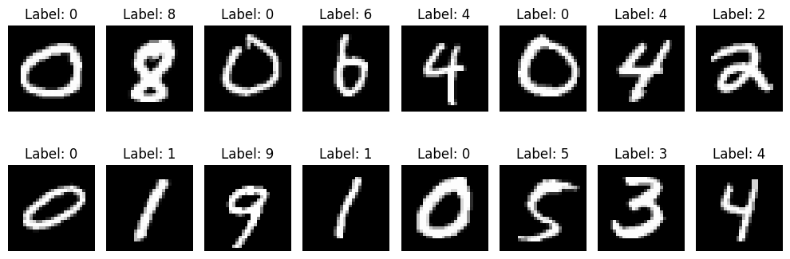
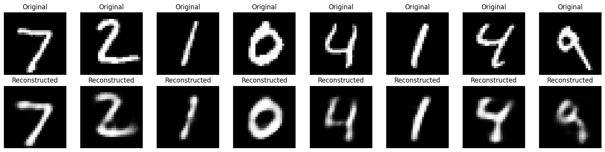
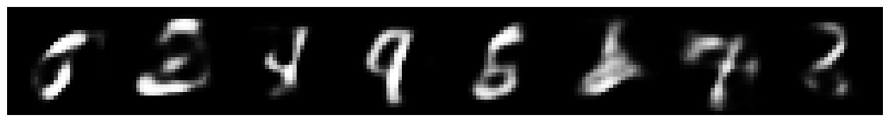

## Variational Autoencoders (VAEs)

### What Is a Variational Autoencoder?

A Variational Autoencoder (VAE) is a special type of autoencoder designed not just to reconstruct inputs, but also to learn the distribution of the data in a way that enables generative modeling.

Unlike traditional autoencoders that learn to map inputs to fixed points in a latent space, VAEs learn to map inputs to distributions in the latent space; typically a multivariate Gaussian. This allows us to sample from the latent space and generate entirely new data that resembles the training set.

---

### Key Idea: Learn a Probability Distribution

In a vanilla autoencoder, the encoder outputs a single vector for each input. In a VAE, the encoder outputs two vectors:

* A vector of **means** $\mu$
* A vector of **log-variances** $\log \sigma^2$

These define a normal distribution for each input in latent space:

$$
z \sim \mathcal{N}(\mu, \sigma^2)
$$

Instead of learning a deterministic representation, the VAE learns to model the uncertainty in the data.


---


## Why VAEs Learn Distributions Instead of Vectors

In traditional autoencoders, we encode an input $\mathbf{x}$ into a fixed vector in latent space. However, Variational Autoencoders (VAEs) take a different approach: instead of mapping an input to a single point, we map it to a probability distribution; typically a Gaussian.

Let’s call this distribution $p_\theta$, parameterized by weights $\theta$. For every input $\mathbf{x}$, the VAE tries to model the relationship between the **latent variables** $\mathbf{z}$ and the input using three probability terms:

* **Prior**: $p_\theta(\mathbf{z})$ — what we believe about the latent space before seeing data.
* **Likelihood**: $p_\theta(\mathbf{x} \mid \mathbf{z})$ — how likely the input is, given a latent code.
* **Posterior**: $p_\theta(\mathbf{z} \mid \mathbf{x})$ — the true distribution of the latent code, given input data.

In an ideal world, if we knew the true parameters $\theta^*$, we could generate new data $\mathbf{x}^{(i)}$ using this two-step process:

1. Sample $\mathbf{z}^{(i)} \sim p_{\theta^*}(\mathbf{z})$ from the prior.
2. Generate $\mathbf{x}^{(i)} \sim p_{\theta^*}(\mathbf{x} \mid \mathbf{z}^{(i)})$.

This means we can generate new, realistic data points simply by sampling from the latent distribution; which is the ultimate goal of generative modeling.

---

## The Optimization Goal

What we want is to find parameters $\theta$ that maximize the probability of generating real data samples:

$$ \theta^{*} = \arg\max_\theta \prod_{i=1}^n p_\theta(\mathbf{x}^{(i)}) $$

To make computation easier we will us logarithm to convert the RHS to a sum 

$$
\theta^* = \arg\max_\theta \sum_{i=1}^n \log p_\theta(\mathbf{x}^{(i)})
$$

from the law of total probability 

$$
p_\theta(\mathbf{x}) = \int p_\theta(\mathbf{x} \mid \mathbf{z}) \, p_\theta(\mathbf{z}) \, d\mathbf{z}
$$

This integral is **intractable** for high-dimensional $\mathbf{z}$. To solve this, VAEs introduce an approximate distribution $q_\phi(\mathbf{z} \mid \mathbf{x})$, parameterized by $\phi$, to estimate the true (and intractable) posterior $p_\theta(\mathbf{z} \mid \mathbf{x})$. You can think of this as a learned encoder.

---

## Loss function


## Deriving the Variational Autoencoder (VAE) Loss

To train the model, we want to minimize how different our approximation $q_\phi(\mathbf{z} \mid \mathbf{x})$ is from the true posterior $p_\theta(\mathbf{z} \mid \mathbf{x})$. This is done using **Kullback-Leibler divergence**:

$$
D_{\text{KL}} \left( q_\phi(\mathbf{z} \mid \mathbf{x}) \,\|\, p_\theta(\mathbf{z} \mid \mathbf{x}) \right)
$$


### What Is an Expected Value?

Before continuing, let’s clarify the **expected value**:

$$
\mathbb{E}_{z \sim q(z)} [f(z)] = \int q(z) \cdot f(z) \, dz
$$

This is the **average** value of $f(z)$ if $z$ is sampled from the distribution $q(z)$.

---

## The Derivation

### KL Divergence Between Approximated and True Posterior

We start with:

$$
D_\text{KL}( q_\phi(\mathbf{z} \vert \mathbf{x}) \| p_\theta(\mathbf{z} \vert \mathbf{x}) )
= \int q_\phi(\mathbf{z} \vert \mathbf{x}) \log \frac{q_\phi(\mathbf{z} \vert \mathbf{x})}{p_\theta(\mathbf{z} \vert \mathbf{x})} d\mathbf{z}
$$

Using the identity $p_\theta(\mathbf{z} \vert \mathbf{x}) = \frac{p_\theta(\mathbf{z}, \mathbf{x})}{p_\theta(\mathbf{x})}$:

$$
= \int q_\phi(\mathbf{z} \vert \mathbf{x}) \log \left( \frac{q_\phi(\mathbf{z} \vert \mathbf{x}) p_\theta(\mathbf{x})}{p_\theta(\mathbf{z}, \mathbf{x})} \right) d\mathbf{z}
$$

Distribute the log:

$$
= \int q_\phi(\mathbf{z} \vert \mathbf{x}) \left[ \log p_\theta(\mathbf{x}) + \log \frac{q_\phi(\mathbf{z} \vert \mathbf{x})}{p_\theta(\mathbf{z}, \mathbf{x})} \right] d\mathbf{z}
$$

Take $\log p_\theta(\mathbf{x})$ out of the integral (since it's constant w\.r.t. $\mathbf{z}$):

$$
= \log p_\theta(\mathbf{x}) + \int q_\phi(\mathbf{z} \vert \mathbf{x}) \log \frac{q_\phi(\mathbf{z} \vert \mathbf{x})}{p_\theta(\mathbf{z}, \mathbf{x})} d\mathbf{z}
$$

Next, use: $p_\theta(\mathbf{z}, \mathbf{x}) = p_\theta(\mathbf{x} \vert \mathbf{z}) p_\theta(\mathbf{z})$:

$$
= \log p_\theta(\mathbf{x}) + \int q_\phi(\mathbf{z} \vert \mathbf{x}) \log \left( \frac{q_\phi(\mathbf{z} \vert \mathbf{x})}{p_\theta(\mathbf{x} \vert \mathbf{z}) p_\theta(\mathbf{z})} \right) d\mathbf{z}
$$

Now separate the terms:

$$
= \log p_\theta(\mathbf{x}) + \int q_\phi(\mathbf{z} \vert \mathbf{x}) \left[ \log \frac{q_\phi(\mathbf{z} \vert \mathbf{x})}{p_\theta(\mathbf{z})} - \log p_\theta(\mathbf{x} \vert \mathbf{z}) \right] d\mathbf{z}
$$

This can be written in expectation form:

<div>
$$
= \log p_\theta(\mathbf{x}) + \mathbb{E}_{\mathbf{z} \sim q_\phi(\mathbf{z} \vert \mathbf{x})} \left[ \log \frac{q_\phi(\mathbf{z} \vert \mathbf{x})}{p_\theta(\mathbf{z})} - \log p_\theta(\mathbf{x} \vert \mathbf{z}) \right]
$$
</div>

Now recognize:

* The first term in the expectation is the KL divergence $D_\text{KL}(q_\phi(\mathbf{z} \vert \mathbf{x}) \| p_\theta(\mathbf{z}))$
* The second is the negative expected log-likelihood under the decoder

So:

<div>
$$
D_\text{KL}( q_\phi(\mathbf{z}\vert\mathbf{x}) \| p_\theta(\mathbf{z}\vert\mathbf{x}) ) = \log p_\theta(\mathbf{x}) + D_\text{KL}( q_\phi(\mathbf{z} \vert \mathbf{x}) \| p_\theta(\mathbf{z}) ) - \mathbb{E}_{q_\phi} [\log p_\theta(\mathbf{x} \vert \mathbf{z})]
$$
</div>

---

### Rearranging

Rearrange the equation:

<div>
$$
\log p_\theta(\mathbf{x}) - D_\text{KL}( q_\phi(\mathbf{z}\vert\mathbf{x}) \| p_\theta(\mathbf{z}\vert\mathbf{x}) ) = \mathbb{E}_{\mathbf{z}\sim q_\phi(\mathbf{z}\vert\mathbf{x})}\log p_\theta(\mathbf{x}\vert\mathbf{z}) - D_\text{KL}(q_\phi(\mathbf{z}\vert\mathbf{x}) \| p_\theta(\mathbf{z}))
$$
</div>

The negation of the above defines our loss function:

<div>
$$
\begin{aligned}
L_\text{VAE}(\theta, \phi) 
&= -\log p_\theta(\mathbf{x}) + D_\text{KL}( q_\phi(\mathbf{z}\vert\mathbf{x}) \| p_\theta(\mathbf{z}\vert\mathbf{x}) )\\
&= - \mathbb{E}_{\mathbf{z} \sim q_\phi(\mathbf{z}\vert\mathbf{x})} \log p_\theta(\mathbf{x}\vert\mathbf{z}) + D_\text{KL}( q_\phi(\mathbf{z}\vert\mathbf{x}) \| p_\theta(\mathbf{z}) ) \\
\theta^{*}, \phi^{*} &= \arg\min_{\theta, \phi} L_\text{VAE}
\end{aligned}
$$
</div>

---

## Final VAE Loss

To train the model, we minimize the loss function

<div>
$$
\mathcal{L}_{\text{VAE}}(\theta, \phi) =
- \mathbb{E}_{\mathbf{z} \sim q_\phi(\mathbf{z} \mid \mathbf{x})} \left[ \log p_\theta(\mathbf{x} \mid \mathbf{z}) \right]
+ D_{\text{KL}}( q_\phi(\mathbf{z} \mid \mathbf{x}) \,\|\, p_\theta(\mathbf{z}) )
$$
</div>

This loss has two parts:

* **Reconstruction Loss**: How well the decoded output matches the input
* **KL Divergence**: Regularizes the latent distribution to stay close to the prior (usually standard normal)

---

## Reparameterization Trick

The reparameterization trick is a key technique in Variational Autoencoders (VAEs) that allows backpropagation through stochastic nodes—specifically, through sampling operations.


### Problem

In VAEs, we sample a latent variable
$\mathbf{z} \sim q_\phi(\mathbf{z} \mid \mathbf{x})$, where $q_\phi$ is usually a Gaussian:


<div>
$$
q_\phi(\mathbf{z} \mid \mathbf{x}) = \mathcal{N}(\mathbf{z} \mid \boldsymbol{\mu}_\phi(\mathbf{x}), \text{diag}(\boldsymbol{\sigma}^2_\phi(\mathbf{x})))
$$
</div>


If you sample directly like:

```python
z = torch.normal(mu, sigma)
```

you cannot compute gradients w.r.t. the parameters $\phi$ of $\mu_\phi$ and $\sigma_\phi$, since sampling is non-differentiable.


### Solution: Reparameterization Trick

We reparameterize the sampling using a differentiable transformation of a noise variable:

<div>
$$
\mathbf{z} = \boldsymbol{\mu}_\phi(\mathbf{x}) + \boldsymbol{\sigma}_\phi(\mathbf{x}) \odot \boldsymbol{\epsilon}, \quad \boldsymbol{\epsilon} \sim \mathcal{N}(\mathbf{0}, \mathbf{I})
$$
</div>

* <div>$\boldsymbol{\mu}_\phi(\mathbf{x})$, $\boldsymbol{\sigma}_\phi(\mathbf{x})$ are outputs of the encoder.</div>
* $\boldsymbol{\epsilon}$ is random noise from a standard normal.
* $\odot$ is element-wise multiplication.

Now, $\mathbf{z}$ is a **deterministic** function of $\mathbf{x}$, $\phi$, and $\boldsymbol{\epsilon}$, which **allows backpropagation** through $\mathbf{z}$.


### In Code:

```python
epsilon = torch.randn_like(std)
z = mu + std * epsilon
```


### Why This Works

You’re rewriting:

<div>
$$
\mathbf{z} \sim \mathcal{N}(\mu, \sigma^2)
\quad \text{as} \quad
\mathbf{z} = \mu + \sigma \cdot \epsilon, \quad \epsilon \sim \mathcal{N}(0, 1)
$$
</div>

This isolates the randomness in $\epsilon$, and makes the path from $\phi$ to $\mathbf{z}$ differentiable.

---

## Closed form solution of the KLD in the loss equation

### What We're Deriving

<div>
$$
D_{\text{KL}}\big(q_\phi(\mathbf{z} \vert \mathbf{x}) \, \| \, p_\theta(\mathbf{z})\big)
$$
</div>

To make the proof simpler lets try for a 1D case

$$
D_{\text{KL}}(q(z)\, \|\, p(z))
$$

Where:

* $q(z) = \mathcal{N}(\mu, \sigma^2)$
* $p(z) = \mathcal{N}(0, 1)$

---

### Step 1: KL Divergence Definition

The KL divergence between two continuous distributions is:

$$
D_{\text{KL}}(q \| p) = \int q(z) \log \frac{q(z)}{p(z)} \, dz
$$

Substitute the probability density functions for Gaussians.

---

### Step 2: Plug in Gaussian PDFs

#### For $q(z) = \mathcal{N}(\mu, \sigma^2)$, the PDF is:

$$
q(z) = \frac{1}{\sqrt{2\pi\sigma^2}} \exp\left(-\frac{(z - \mu)^2}{2\sigma^2}\right)
$$

#### For $p(z) = \mathcal{N}(0, 1)$, the PDF is:

$$
p(z) = \frac{1}{\sqrt{2\pi}} \exp\left(-\frac{z^2}{2}\right)
$$

---

### Step 3: Compute the log of the ratio

<div>
$$
\log \frac{q(z)}{p(z)} = 
\log \left( \frac{1}{\sqrt{2\pi\sigma^2}} \cdot \frac{\sqrt{2\pi}}{1} \right)
+ \left( -\frac{(z - \mu)^2}{2\sigma^2} + \frac{z^2}{2} \right)
$$
</div>

Simplify the constants:

<div>
$$
\log \left( \frac{1}{\sqrt{\sigma^2}} \right) = -\frac{1}{2} \log \sigma^2
$$
</div>

So:

<div>
$$
\log \frac{q(z)}{p(z)} = -\frac{1}{2} \log \sigma^2 + \frac{1}{2} \left( z^2 - \frac{(z - \mu)^2}{\sigma^2} \right)
$$
</div>

---

### Step 4: Take the expectation over $z \sim q(z)$

Now compute the expectation:

<div>
$$
D_{\text{KL}} = \mathbb{E}_{q(z)} \left[ -\frac{1}{2} \log \sigma^2 + \frac{1}{2} \left( z^2 - \frac{(z - \mu)^2}{\sigma^2} \right) \right]
$$
</div>

Break it into pieces:

* $\mathbb{E}_{q(z)}[z^2] = \mu^2 + \sigma^2$
* $\mathbb{E}_{q(z)}[(z - \mu)^2] = \sigma^2$

So:

<div>
$$
D_{\text{KL}} = -\frac{1}{2} \log \sigma^2 + \frac{1}{2} \left( \mu^2 + \sigma^2 - 1 \right)
$$
</div>

Rearranging:

<div>
$$
D_{\text{KL}} = \frac{1}{2} \left( \mu^2 + \sigma^2 - \log \sigma^2 - 1 \right)
$$
</div>

---

### Final Answer:

<div>
$$
\boxed{D_{\text{KL}}(q(z) \, \| \, p(z)) = \frac{1}{2} \left( \mu^2 + \sigma^2 - \log \sigma^2 - 1 \right)}
$$
</div>

This is the 1-dimensional case. In the multivariate case (with independent latent variables), you sum this over all dimensions.

<div>
$$
\boxed{
D_{\text{KL}}\big(q_\phi(\mathbf{z} \vert \mathbf{x}) \, \| \, p_\theta(\mathbf{z})\big)
= \frac{1}{2} \sum_{j=1}^d \left( \mu_j^2 + \sigma_j^2 - \log \sigma_j^2 - 1 \right)
}
$$
</div>

---

## CODE AND EXPLANATION

You can explore the notebook here:

- 📘 <a href="https://github.com/Tony-Ale/Notebooks/blob/main/Variational_Autoencoder.ipynb" target="_blank">View on GitHub</a>  
- 🚀 <a href="https://colab.research.google.com/github/Tony-Ale/Notebooks/blob/main/Variational_Autoencoder.ipynb" target="_blank">Open in Colab</a>
---

### First of all load the dataset 

```python
# =======================
# Load the MNIST handwritten digit dataset and return DataLoaders for training and testing.
# Each image is converted to a PyTorch tensor and normalized to the [0, 1] range.
# DataLoaders enable efficient batching, shuffling, and iteration during training.
# =======================
from torchvision import datasets, transforms # Import MNIST dataset and image transforms
from torch.utils.data import DataLoader # For batching and loading the dataset

def get_mnist_loaders(batch_size=128):

  # Convert images to PyTorch tensors with values scaled to [0, 1]
  transform = transforms.ToTensor()

  # Download and load the training dataset
  train_dataset = datasets.MNIST(root='./data', train=True, download=True, transform=transform)

  # Download and load the test dataset
  test_dataset = datasets.MNIST(root='./data', train=False, download=True, transform=transform)

  # Wrap datasets in DataLoaders to enable batching and shuffling
  train_loader = DataLoader(train_dataset, batch_size=batch_size, shuffle=True)
  test_loader = DataLoader(test_dataset, batch_size=batch_size, shuffle=False)

  return train_loader, test_loader

```

---
### Write helper code to visualize data set

```python
# =======================
# Visualize a batch of MNIST digit images from the training dataset.
# This function loads a mini-batch using get_mnist_loaders() and displays the digits with their labels.
# Useful for quickly inspecting the raw input data before training.
# =======================
import matplotlib.pyplot as plt # For plotting and displaying images
def visualize_batch(batch_size=16):
  # Load a mini-batch of training data
  train_loader, _ = get_mnist_loaders(batch_size)
  images, labels = next(iter(train_loader)) # Get the first batch

  # Create a horizontal grid of images
  plt.figure(figsize=(10, 4))
  for i in range(batch_size):
    plt.subplot(2, batch_size // 2, i + 1) # 2 rows, batch_size/2 columns
    plt.imshow(images[i][0], cmap='gray') # Show the image (channel 0 since MNIST is grayscale)
    plt.title(f"Label: {labels[i].item()}")
    plt.axis('off')
  plt.tight_layout()
  plt.show()
```


```python
visualize_batch()
```


    

    

---

### Define the Model Architecture


```python
# =======================
# Define a fully-connected Autoencoder for compressing and reconstructing MNIST digit images.
# Architecture:
#   Encoder: 784 → 128 → 32
#   Decoder: 32 → 128 → 784
# The model learns to compress 28x28 images into a 32-dimensional latent space and reconstruct them.
# =======================
import torch
import torch.nn as nn
class VAE(nn.Module):
  def __init__(self, input_dim=784, hidden_dim=128, latent_dim=32):
    super().__init__()

    # Encoder layers
    self.fc1 = nn.Linear(input_dim, hidden_dim)
    self.fc_mu = nn.Linear(hidden_dim,  latent_dim) # the mean
    self.fc_logvar = nn.Linear(hidden_dim, latent_dim) # the log of the variance

    # Decoder layers
    self.fc3 = nn.Linear(latent_dim, hidden_dim)
    self.fc4 = nn.Linear(hidden_dim, input_dim)

  def encode(self, x):
    h1 = torch.relu(self.fc1(x))
    return self.fc_mu(h1), self.fc_logvar(h1)

  def reparameterize(self, mu, logvar):
    std = torch.exp(0.5*logvar)
    eps = torch.randn_like(std)
    z = mu + eps*std
    return z

  def decode(self, z):
    h3 = torch.relu(self.fc3(z))
    return torch.sigmoid(self.fc4(h3))

  def forward(self, x):
    x = x.view(x.size(0), -1) # Flatten image: [batch, 1, 28, 28] -> [batch, 784]
    mu, logvar = self.encode(x)
    z = self.reparameterize(mu, logvar)
    out = self.decode(z) # Decode back to reconstructed image
    return out, mu, logvar
```

In a Variational Autoencoder (VAE), the encoder outputs a **mean vector** and a **covariance** for the latent variable $\mathbf{z}$.

Instead of using a full $D \times D$ covariance matrix (which is large and expensive to work with), we **assume the covariance is diagonal**. This means:

* The latent dimensions are **independent** of each other.
* So, the covariance matrix only has values on its diagonal (no off-diagonal terms).

Because of this, we **don’t need to store the full matrix** — we just store the **diagonal values** (the variances) in a **vector** of size $D$.

---

### Run the dataset loader function

```python
train_loader, test_loader = get_mnist_loaders()
```

---
### Initialize the model

```python
# Initialize model
device = torch.device("cuda" if torch.cuda.is_available() else "cpu")
model = VAE()
model.to(device)
```


    VAE(
      (fc1): Linear(in_features=784, out_features=128, bias=True)
      (fc_mu): Linear(in_features=128, out_features=32, bias=True)
      (fc_logvar): Linear(in_features=128, out_features=32, bias=True)
      (fc3): Linear(in_features=32, out_features=128, bias=True)
      (fc4): Linear(in_features=128, out_features=784, bias=True)
    )


---

### Write Loss Function

```python
import torch.nn.functional as F
def loss_function(recon_x, x, mu, logvar):
  bce_loss = F.binary_cross_entropy(recon_x, x.view(x.size(0), -1), reduction='sum')

  # KL Divergence
  kld = -0.5 * torch.sum(1 + logvar - mu.pow(2) - logvar.exp())

  # Normalize both terms by batch size (per-sample average)
  batch_size = x.size(0)
  loss = (bce_loss + kld) / batch_size

  return loss
```
We use reduction='sum' to accumulate the total negative log-likelihood over all pixels and all batch items.

Why not 'mean'? (which is the default way of calculating BCE)
Because:

The KL term is already a sum across dimensions

To keep BCE and KL on the same scale, we sum both, otherwise the KL term becomes relatively too strong when BCE is averaged.

---

```python
optim = torch.optim.Adam(model.parameters(), lr=1e-3)
```

---
### Train the model
```python
# Train model
epochs = 10
for epoch in range(epochs):
  running_loss = 0.0
  for data in train_loader:
    inputs, _ = data
    inputs = inputs.to(device)
    optim.zero_grad()
    outputs, mu, logvar = model(inputs)
    loss = loss_function(outputs, inputs, mu, logvar)
    loss.backward()
    optim.step()
    running_loss += loss.item()
  print(f"Epoch {epoch+1}/{epochs}, Loss: {running_loss/len(train_loader):.4f}")

```

    Epoch 1/10, Loss: 193.2529
    Epoch 2/10, Loss: 141.5911
    Epoch 3/10, Loss: 128.7490
    Epoch 4/10, Loss: 122.4878
    Epoch 5/10, Loss: 118.5537
    Epoch 6/10, Loss: 115.9418
    Epoch 7/10, Loss: 114.2570
    Epoch 8/10, Loss: 113.0838
    Epoch 9/10, Loss: 112.2591
    Epoch 10/10, Loss: 111.6781


---
### Test the model 

```python
# Test model
model.eval()
with torch.no_grad():
  test_loss = 0.0
  for data in test_loader:
    inputs, _ = data
    inputs = inputs.to(device)
    outputs, mu, logvar = model(inputs)
    loss = loss_function(outputs, inputs, mu, logvar)
    test_loss += loss.item()
  print(f'Test Loss: {test_loss / len(test_loader)}')

```

    Test Loss: 110.1176515410218


---
### Visualize reconstruciton

```python
# Visualize reconstruciton
model.eval()
with torch.no_grad():
    sample_imgs, _ = next(iter(test_loader))
    sample_imgs = sample_imgs.to(device)
    reconstructed, _, _ = model(sample_imgs)

# Plot original vs reconstructed
n = 8
plt.figure(figsize=(16, 4))
for i in range(n):
    # Original
    plt.subplot(2, n, i + 1)
    plt.imshow(sample_imgs[i][0].cpu(), cmap='gray')
    plt.title("Original")
    plt.axis('off')

    # Reconstructed
    plt.subplot(2, n, i + 1 + n)
    plt.imshow(reconstructed[i].view(28, 28).cpu(), cmap='gray')
    plt.title("Reconstructed")
    plt.axis('off')

plt.tight_layout()
plt.show()
```


    

    

---
### Generate new samples

```python
# Generating new samples
import torch
import matplotlib.pyplot as plt

# Set to eval mode and disable gradients
model.eval()
with torch.no_grad():
    # Sample z ~ N(0, I)
    z = torch.randn(8, 32).to(device)  # 8 samples

    # Decode z to x
    generated = model.decode(z)  # Output is (batch_size, 1, 28, 28) or (batch_size, 784)

    # Reshape if needed
    if generated.shape[-1] == 784:
        generated = generated.view(-1, 1, 28, 28)

    # Plot samples
    plt.figure(figsize=(16, 4))
    grid = torch.cat([img for img in generated.cpu()], dim=2).squeeze()
    plt.imshow(grid, cmap='gray')
    plt.axis('off')
    plt.show()

```


    


---


